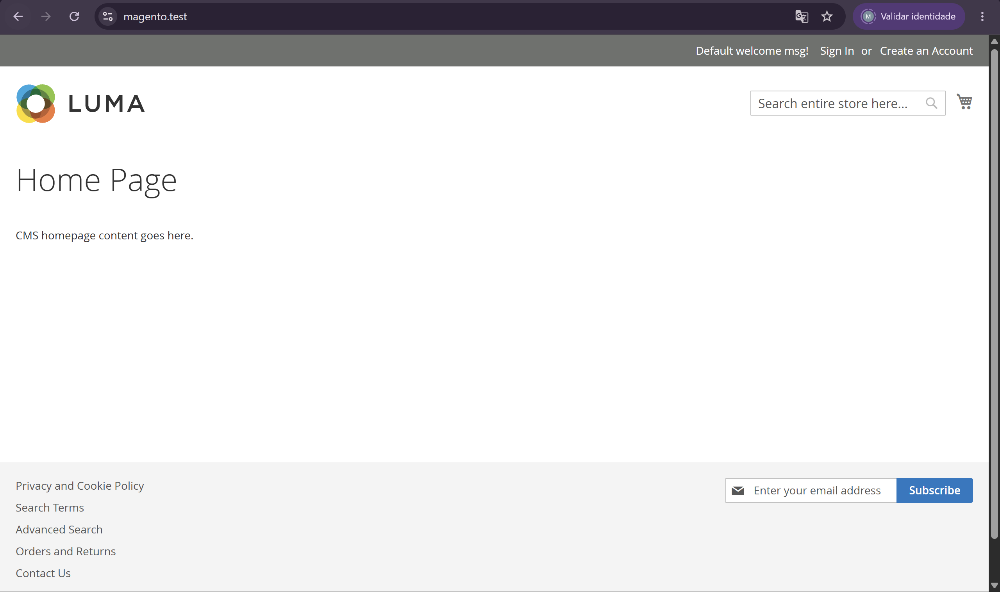
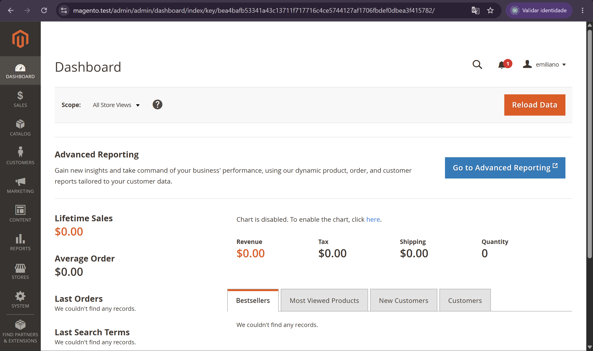
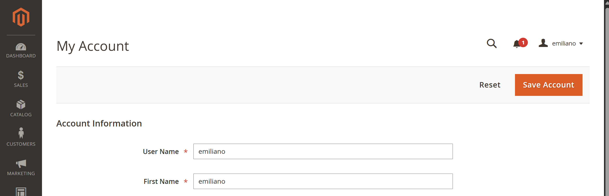
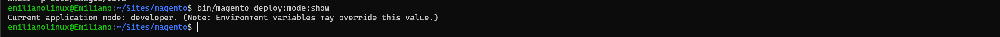
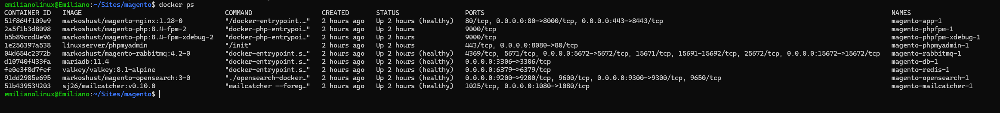
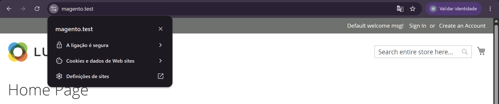

# 🐳 Desafio 12.1 — Ambiente Magento no ar

> Configuração de um ambiente local de desenvolvimento Magento Open Source utilizando Windows, WSL2, Docker e docker-magento.

---

## 📋 Informações do desafio

| Item | Informação |
|---|---|
| Sprint | Sprint 6 — Magento 2 |
| Semana | 12 |
| Desafio | 12.1 — Ambiente Magento no ar |
| Prioridade | Obrigatório |
| Magento | Open Source 2.4.8-p1 |
| Ambiente | Local / Developer |
| Sistema host | Windows |
| Ambiente Linux | WSL2 — Ubuntu 22.04 |
| Orquestração | Docker / docker-magento |
| Storefront | `https://magento.test` |
| Admin | `https://magento.test/admin/` |

---

# 🎯 Objetivo

O objetivo deste desafio foi preparar um ambiente local completo para desenvolvimento em Magento 2.

O ambiente deveria permitir:

- executar o Magento através de containers Docker;
- acessar a storefront local;
- acessar o painel administrativo;
- criar um usuário administrativo próprio;
- manter a aplicação no modo `developer`;
- operar o ambiente utilizando os comandos fornecidos pelo `docker-magento`;
- compreender e resolver problemas comuns de instalação no Windows com WSL2.

---

# ✅ Critérios de aceite

| Critério | Status |
|---|:---:|
| Site abrindo em `https://magento.test` | ✅ |
| Admin acessível | ✅ |
| Usuário próprio criado com `admin:user:create` | ✅ |
| Modo `developer` confirmado | ✅ |
| Passo a passo documentado | ✅ |
| Problemas encontrados documentados | ✅ |
| Print da storefront | ✅ |
| Print do Admin | ✅ |

---

# 🏗️ Arquitetura do ambiente

O Magento não é executado diretamente no Windows.

A estrutura utilizada foi:

```text
Windows
│
├── Docker Desktop
│
└── WSL2
    │
    └── Ubuntu 22.04
        │
        └── ~/Sites/magento
            │
            └── docker-magento
                │
                ├── PHP
                ├── Nginx
                ├── MySQL
                ├── OpenSearch
                ├── Redis
                ├── RabbitMQ
                └── Magento Open Source
```

O projeto foi mantido dentro do filesystem do Linux:

```text
~/Sites/magento
```

e não em:

```text
/mnt/c/...
```

Isso evita perda significativa de desempenho no acesso aos arquivos através do WSL.

---

# 🧰 Pré-requisitos

Antes da instalação do Magento, o ambiente já possuía:

- Windows;
- WSL2;
- Ubuntu 22.04;
- Docker Desktop;
- Git.

A integração entre Docker Desktop e WSL também foi validada.

---

# 🔎 Validação do WSL2

No Windows, foi confirmado que o Ubuntu estava utilizando WSL2:

```powershell
wsl -l -v
```

O Ubuntu utilizado no projeto:

```text
Ubuntu-22.04
```

com:

```text
VERSION 2
```

---

# 🐳 Validação do Docker

Dentro do Ubuntu/WSL:

```bash
docker --version
```

Também foi executado:

```bash
docker run hello-world
```

O container de teste foi executado corretamente, confirmando que o Docker estava acessível a partir do WSL.

---

# 🐧 Preparação do Ubuntu

As dependências necessárias foram instaladas:

```bash
sudo apt update

sudo apt install -y \
  curl \
  libnss3-tools \
  unzip \
  rsync \
  bc \
  jq \
  dos2unix
```

---

## 🔤 Configuração de LF

Como os scripts do ambiente são executados em Linux, o Git foi configurado para não converter automaticamente os arquivos para CRLF:

```bash
git config --global core.autocrlf false
git config --global core.eol lf
```

Validação:

```bash
git config --global core.autocrlf
git config --global core.eol
```

Resultado:

```text
false
lf
```

---

# 📁 Criação do projeto

O projeto foi criado dentro da home do usuário Linux:

```bash
cd ~

mkdir -p Sites/magento

cd Sites/magento
```

O diretório utilizado ficou equivalente a:

```text
/home/<usuario>/Sites/magento
```

---

# 📦 Instalação do docker-magento

A estrutura base foi criada utilizando o template oficial do `docker-magento`:

```bash
curl -s https://raw.githubusercontent.com/markshust/docker-magento/master/lib/template | bash
```

Após a execução, foram criados arquivos e diretórios como:

```text
bin/
env/
compose.yaml
compose.dev.yaml
compose.dev-linux.yaml
compose.healthcheck.yaml
```

---

# 🔤 Correção de CRLF nos scripts

Para garantir que os scripts fossem executáveis pelo Linux:

```bash
find ./bin -type f -exec sed -i 's/\r$//' {} +

find ./env -type f -exec sed -i 's/\r$//' {} +
```

---

# 🐧 Compose otimizado para Linux

Foi utilizada a configuração de desenvolvimento voltada para Linux:

```bash
cp compose.dev-linux.yaml compose.dev.yaml
```

---

# 💾 Configuração de memória do WSL

Durante a primeira tentativa de download do Magento, o ambiente informou:

```text
There must be at least 6GB of RAM allocated to Docker to continue.
```

Foi identificado que o WSL estava limitado a aproximadamente 4 GB.

O arquivo:

```text
C:\Users\<usuario>\.wslconfig
```

foi alterado para:

```ini
[wsl2]
memory=8GB
swap=2GB
```

Depois da alteração, o WSL foi encerrado:

```powershell
wsl --shutdown
```

O Docker Desktop e o Ubuntu foram iniciados novamente.

---

# 📥 Download do Magento

A versão utilizada no projeto foi:

```text
Magento Open Source 2.4.8-p1
```

O download foi executado com:

```bash
bin/download community 2.4.8-p1
```

Durante esse processo, o Composer solicitou autenticação no:

```text
repo.magento.com
```

Foram utilizadas as Access Keys do Magento Marketplace:

```text
Username → Public Key
Password → Private Key
```

> 🔐 As chaves utilizadas no Composer não são versionadas no Git.

---

# 🌐 Configuração do domínio local

O domínio utilizado para desenvolvimento foi:

```text
magento.test
```

## WSL

Foi adicionada uma entrada no:

```text
/etc/hosts
```

com:

```text
127.0.0.1 magento.test
```

---

## Windows

A mesma entrada foi adicionada em:

```text
C:\Windows\System32\drivers\etc\hosts
```

com:

```text
127.0.0.1 magento.test
```

---

# ⚙️ Instalação do Magento

Após o download e configuração dos serviços:

```bash
bin/setup magento.test
```

Ao final da instalação, o ambiente informou que a storefront e o Admin estavam disponíveis.

### Storefront

```text
https://magento.test
```

### Admin

```text
https://magento.test/admin/
```

---

# 👤 Usuário administrativo próprio

O usuário criado automaticamente durante o setup não foi utilizado como usuário definitivo da entrega.

Foi criado um usuário administrativo próprio utilizando:

```bash
bin/magento admin:user:create
```

O Magento solicitou:

```text
Admin user
Admin password
Admin email
Admin first name
Admin last name
```

Após a criação, foi retornada a confirmação:

```text
Created Magento administrator user named emiliano
```

---

## 🔐 Autenticação em dois fatores

No primeiro acesso do novo usuário ao Admin, o Magento solicitou configuração de autenticação em dois fatores.

Foi utilizado um aplicativo compatível com TOTP através da opção:

```text
Google Authenticator
```

Após concluir a configuração, o usuário próprio conseguiu acessar normalmente o Dashboard administrativo.

---

# 🛠️ Modo Developer

O ambiente local deve ser executado no modo:

```text
developer
```

A configuração foi verificada com:

```bash
bin/magento deploy:mode:show
```

Resultado:

```text
Current application mode: developer
```

---

# 🧪 Comandos Magento validados

Além da instalação, foram testados alguns dos principais comandos utilizados no desenvolvimento.

---

## 🔧 `setup:upgrade`

```bash
bin/magento setup:upgrade
```

### Função

Processa alterações estruturais do Magento, principalmente relacionadas a módulos, configurações e atualizações de setup.

O comando foi executado com sucesso.

---

## 🧹 `cache:clean`

```bash
bin/magento cache:clean
```

### Função

Limpa os caches utilizados pelo Magento.

É utilizado quando uma alteração foi realizada, mas ainda não está sendo refletida na aplicação.

O comando também foi utilizado para remover um aviso de cache invalidado exibido no Admin.

---

## 🔎 `indexer:reindex`

```bash
bin/magento indexer:reindex
```

### Função

Reconstrói os índices utilizados pelo Magento para melhorar a performance de consultas.

Entre os dados indexados estão informações relacionadas a:

- produtos;
- categorias;
- preços;
- estoque;
- regras do catálogo.

Todos os indexadores foram reconstruídos com sucesso.

---

# 🧯 Troubleshooting

A configuração do ambiente apresentou alguns problemas importantes.

---

## ⚠️ Problema 1 — `proftpd-core`

### Sintoma

Durante:

```bash
sudo apt install
```

o `dpkg` não conseguia concluir a configuração do pacote:

```text
proftpd-core
```

---

### Diagnóstico

Foi executado:

```bash
systemctl --failed
```

e:

```bash
sudo systemctl status proftpd --no-pager -l
```

O serviço apresentava erro de configuração.

Foram encontradas diretivas inválidas em:

```text
/etc/proftpd/proftpd.conf
```

Entre elas:

```text
DefaultRoot~
```

e:

```text
RequireValidShell~
```

---

### Solução

As configurações foram corrigidas para valores válidos.

A sintaxe foi validada com:

```bash
sudo proftpd --configtest -c /etc/proftpd/proftpd.conf
```

Resultado:

```text
Syntax check complete.
```

Depois:

```bash
sudo dpkg --configure -a
sudo apt --fix-broken install
sudo apt update
```

### ✅ Resultado

O sistema de pacotes voltou a funcionar corretamente.

---

# ⚠️ Problema 2 — Memória insuficiente

### Sintoma

Durante o download do Magento:

```text
There must be at least 6GB of RAM allocated to Docker to continue.
```

---

### Causa

O computador possuía aproximadamente:

```text
16 GB RAM
```

mas o WSL estava limitado a cerca de:

```text
4 GB
```

---

### Solução

O `.wslconfig` foi alterado para:

```ini
[wsl2]
memory=8GB
swap=2GB
```

Depois:

```powershell
wsl --shutdown
```

### ✅ Resultado

O Docker passou a possuir memória suficiente para iniciar os serviços do Magento.

---

# ⚠️ Problema 3 — Porta `3306` ocupada

### Sintoma

O container do banco não conseguia iniciar.

O Docker retornava erro semelhante a:

```text
Ports are not available
listen tcp4 0.0.0.0:3306
```

---

### Diagnóstico

No Windows foi executado:

```powershell
Get-NetTCPConnection -LocalPort 3306
```

Foi identificado o processo:

```text
mysqld
```

e posteriormente o serviço:

```text
MySQL80
```

---

### Solução

O MySQL instalado diretamente no Windows foi parado:

```powershell
Stop-Service -Name MySQL80
```

### ✅ Resultado

O container:

```text
magento-db-1
```

passou a iniciar corretamente e atingir estado saudável.

---

# ⚠️ Problema 4 — OpenSearch `unhealthy`

### Sintoma

Durante:

```bash
bin/setup magento.test
```

a instalação era interrompida com:

```text
dependency failed to start:
container magento-opensearch-1 is unhealthy
```

---

### Diagnóstico

Os logs foram analisados:

```bash
docker logs magento-opensearch-1 --tail 120
```

Também foi conferido:

```bash
sysctl vm.max_map_count
```

Resultado:

```text
vm.max_map_count = 262144
```

O OpenSearch estava conseguindo iniciar.

Nos logs foi possível observar:

```text
Cluster health status changed from [RED] to [GREEN]
```

e posteriormente:

```bash
docker inspect magento-opensearch-1 --format='{{json .State.Health}}'
```

retornou:

```text
"Status":"healthy"
```

---

### Causa

O OpenSearch demorava mais para concluir a inicialização do que o healthcheck permitia.

---

### Solução

O arquivo:

```text
compose.healthcheck.yaml
```

foi ajustado para aumentar a tolerância do healthcheck:

```yaml
opensearch:
  healthcheck:
    interval: 5s
    timeout: 5s
    retries: 30
```

### ✅ Resultado

O OpenSearch passou a atingir `healthy` antes do timeout e o setup conseguiu continuar.

---

# ⚠️ Problema 5 — SSL não confiável

### Sintoma

O Magento estava funcionando em:

```text
https://magento.test
```

mas o Chrome apresentava a conexão como:

```text
Inseguro
```

---

### Configuração inicial

Foi executado:

```bash
bin/setup-ssl magento.test
```

Mesmo assim, o Windows não confiava no certificado.

---

### Diagnóstico

O certificado servido pelo Magento foi analisado:

```bash
echo | openssl s_client \
  -connect magento.test:443 \
  -servername magento.test 2>/dev/null \
  | openssl x509 -noout -subject -issuer -ext subjectAltName
```

Foi identificado que o certificado havia sido assinado por uma CA criada dentro do ambiente Docker.

Essa CA era diferente da CA criada pelo `mkcert` instalado diretamente no WSL.

---

### Solução

A CA correta foi copiada diretamente do container:

```bash
docker cp \
  "$(bin/docker-compose ps -q app):/root/.local/share/mkcert/rootCA.pem" \
  ./docker-magento-rootCA.pem
```

O certificado foi validado:

```bash
openssl x509 \
  -in docker-magento-rootCA.pem \
  -noout \
  -subject
```

Depois, a CA foi importada nas autoridades certificadoras confiáveis do Windows.

---

### ✅ Resultado

Após fechar completamente e iniciar novamente o Chrome:

```text
https://magento.test
```

passou a ser reconhecido como uma conexão confiável.

> 🔐 O arquivo da CA utilizado somente para configuração local está ignorado pelo Git e não deve ser versionado.

---

# 📸 Evidências

As imagens utilizadas para comprovar a conclusão do desafio ficam em:

```text
docs/images/12.1/
```

---

## 🛍️ Storefront funcionando

Arquivo:

```text
docs/images/12.1/storefront.png
```



> Print da storefront carregada em `https://magento.test`.

---

## 🔐 Admin funcionando

Arquivo:

```text
docs/images/12.1/admin-dashboard.png
```



> Print do Dashboard administrativo utilizando o usuário próprio.

---

## 👤 Usuário administrativo próprio

Arquivo:

```text
docs/images/12.1/admin-user.png
```



> Evidência de acesso ao Admin com o usuário criado através de `admin:user:create`.

---

## 🛠️ Developer mode

Arquivo:

```text
docs/images/12.1/developer-mode.png
```



> Evidência do comando `bin/magento deploy:mode:show` retornando `developer`.

---

## 🐳 Containers

Arquivo:

```text
docs/images/12.1/docker-containers.png
```



> Evidência dos principais serviços do ambiente em execução.

---

## 🔒 SSL

Arquivo:

```text
docs/images/12.1/ssl.png
```



> Evidência da storefront acessível via HTTPS com certificado confiável.

---

# 💡 Aprendizados

O principal aprendizado deste desafio foi que uma aplicação Magento depende de vários serviços trabalhando em conjunto.

Problemas aparentemente relacionados ao Magento podem, na realidade, estar relacionados a:

- WSL;
- memória disponível;
- portas do sistema;
- Docker;
- banco de dados;
- OpenSearch;
- permissões;
- certificados;
- configuração de rede.

Também ficou claro que, no Windows, três pontos precisam de atenção especial:

1. manter o projeto dentro do filesystem do WSL;
2. utilizar arquivos com final de linha LF;
3. disponibilizar memória suficiente ao Docker.

O processo de troubleshooting também mostrou a importância de investigar o erro antes de alterar configurações, utilizando ferramentas como:

```bash
docker logs
docker inspect
systemctl
sysctl
```

---

# ✅ Resultado final

Ao concluir o desafio, o ambiente apresenta:

```text
Magento Open Source 2.4.8-p1
        │
        ├── Storefront ✅
        ├── Admin ✅
        ├── Usuário próprio ✅
        ├── 2FA ✅
        ├── Developer Mode ✅
        │
        ├── MySQL ✅
        ├── OpenSearch ✅
        ├── Redis ✅
        ├── RabbitMQ ✅
        │
        └── HTTPS confiável ✅
```

O ambiente está pronto para os próximos desafios da Sprint 6.

---

## ➡️ Próximo desafio

[12.2 — Explorando a loja e o catálogo](12.2-store-catalog.md)