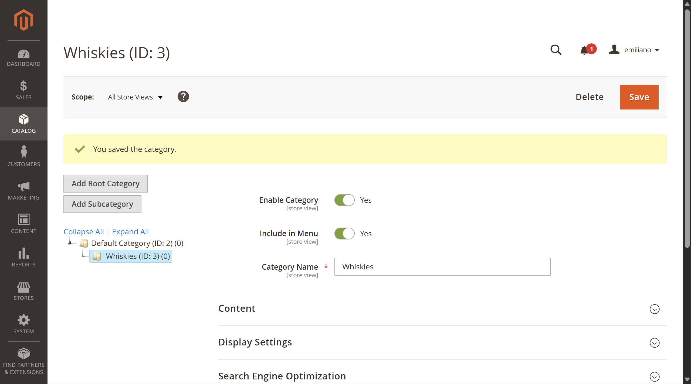
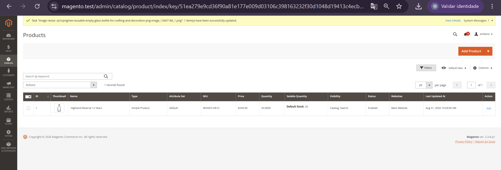
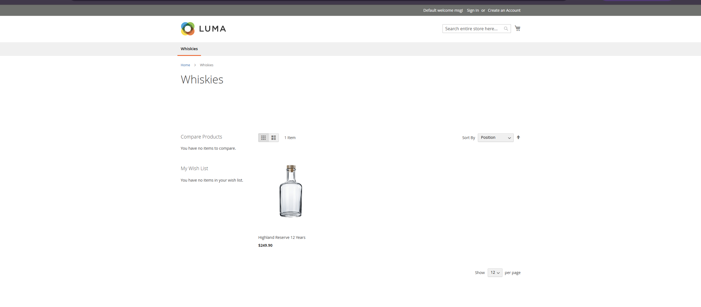
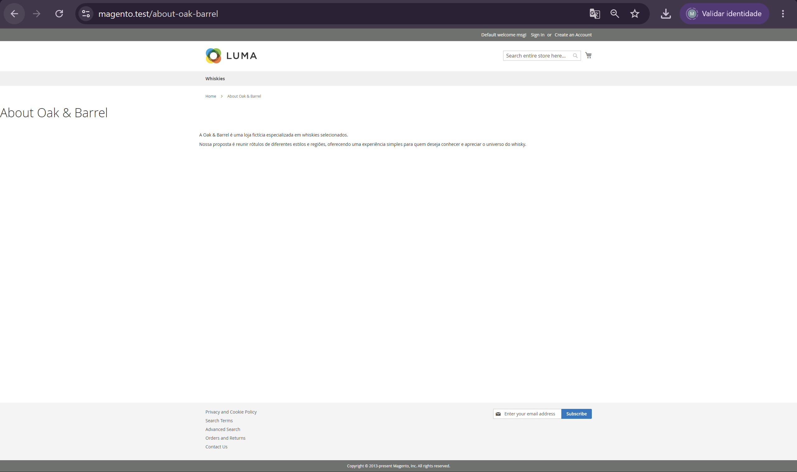
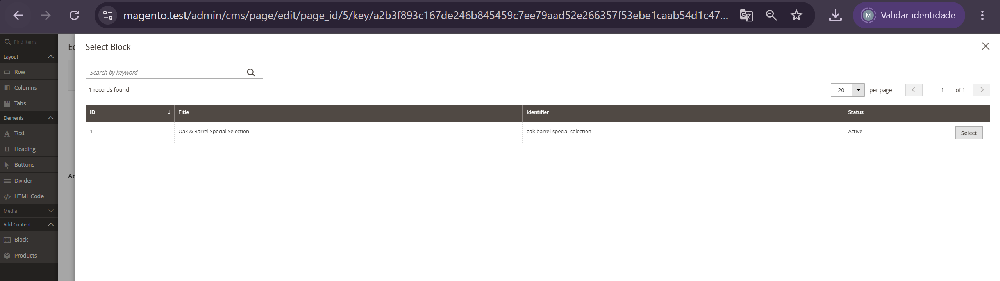
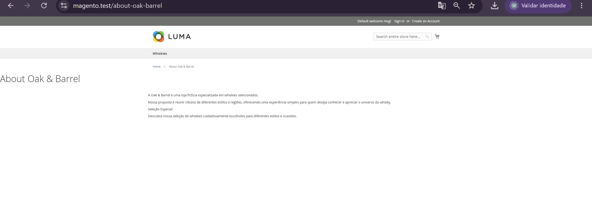
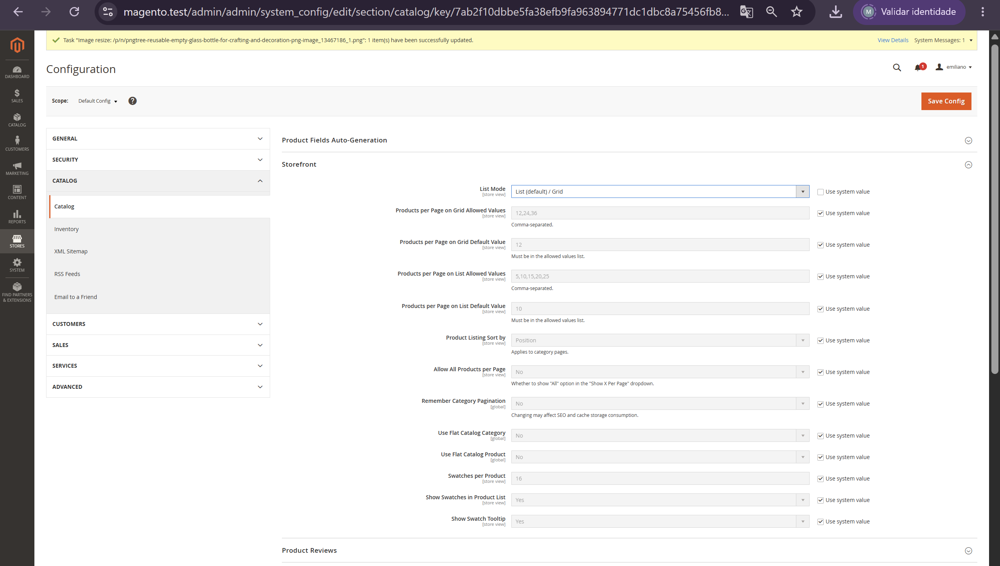
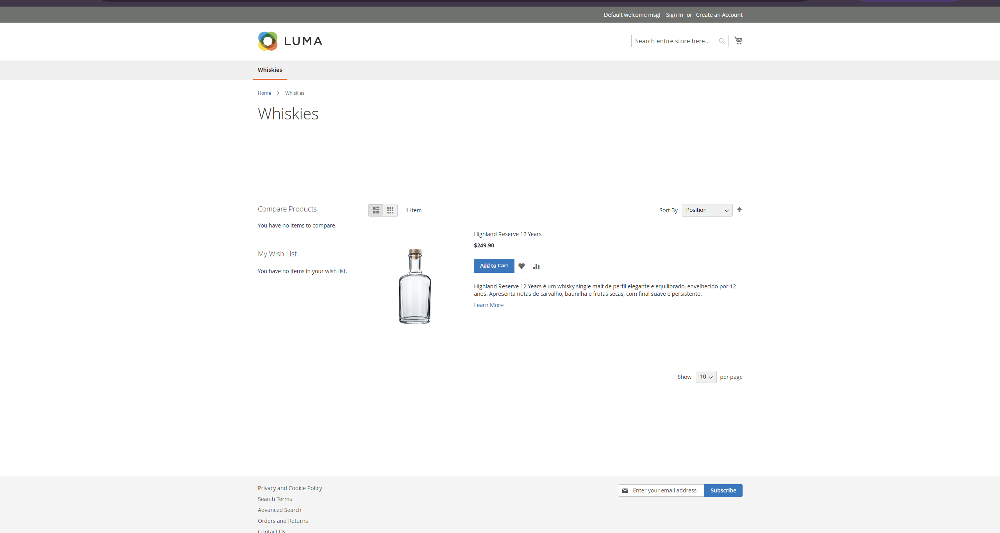

# 🛍️ Desafio 12.2 — Explorando a loja e o catálogo

> Exploração dos principais recursos administrativos do Magento através da criação de catálogo, produto, conteúdo CMS e configuração da storefront.

---

## 📋 Informações do desafio

| Item | Informação |
|---|---|
| Sprint | Sprint 6 — Magento 2 |
| Semana | 12 |
| Desafio | 12.2 — Explorando a loja e o catálogo |
| Prioridade | Obrigatório |
| Magento | Open Source 2.4.8-p1 |
| Ambiente | Local / Developer |
| Storefront | `https://magento.test` |
| Admin | `https://magento.test/admin/` |
| Identidade fictícia | Oak & Barrel |
| Categoria | Whiskies |
| Produto | Highland Reserve 12 Years |

---

# 🎯 Objetivo

O objetivo deste desafio foi explorar os principais recursos administrativos do Magento relacionados ao catálogo, conteúdo CMS e configurações da storefront.

Para manter os conteúdos criados durante o exercício coerentes entre si, foi utilizada a identidade fictícia:

```text
Oak & Barrel
```

representando uma loja especializada em whiskies.

Durante o desafio foram realizadas as seguintes atividades:

- criação de uma categoria;
- criação de um produto simples;
- associação do produto à categoria;
- configuração e validação do estoque;
- exibição do produto na storefront;
- criação de uma página CMS;
- criação de um CMS Block;
- utilização do CMS Block em uma página;
- alteração de uma configuração da storefront;
- validação visual do efeito da configuração;
- compreensão da estrutura `Website → Store → Store View`.

---

# ✅ Critérios de aceite

| Critério | Status |
|---|:---:|
| Categoria criada | ✅ |
| Produto simples criado | ✅ |
| Produto associado à categoria | ✅ |
| Produto visível na storefront | ✅ |
| Página CMS criada | ✅ |
| CMS Block criado | ✅ |
| CMS Block exibido na storefront | ✅ |
| Configuração alterada em `Stores → Configuration` | ✅ |
| Efeito da configuração comprovado na storefront | ✅ |
| Website, Store e Store View compreendidos | ✅ |
| Evidências registradas | ✅ |

---

# 🗂️ Criação da categoria

A primeira etapa foi a criação de uma categoria para organizar os produtos da loja.

No Magento Admin foi acessado:

```text
Catalog → Categories
```

A categoria foi criada como filha de:

```text
Default Category
```

com a seguinte configuração:

```text
Category Name: Whiskies
Enable Category: Yes
Include in Menu: Yes
```

A estrutura resultante ficou:

```text
Default Category
│
└── Whiskies
```

---

## 🔎 Enable Category

A opção:

```text
Enable Category
```

define se a categoria está ativa.

Foi utilizado:

```text
Yes
```

permitindo que a categoria pudesse ser utilizada normalmente pela storefront.

---

## 📑 Include in Menu

A opção:

```text
Include in Menu
```

foi mantida como:

```text
Yes
```

fazendo com que a categoria `Whiskies` aparecesse na navegação principal da loja.

---

# 🥃 Criação do produto

Após a categoria, foi criado um produto através de:

```text
Catalog → Products → Add Product
```

Foi utilizado um:

```text
Simple Product
```

Esse tipo representa um produto individual que não depende de variações configuráveis como tamanho ou cor.

---

## ⚙️ Configuração do produto

O produto fictício criado foi:

```text
Highland Reserve 12 Years
```

com:

```text
SKU: WHISKY-HR12
Price: 249.90
Quantity: 20
Stock Status: In Stock
Visibility: Catalog, Search
Status: Enabled
Category: Whiskies
```

Também foram adicionadas:

- imagem;
- descrição;
- associação com a categoria `Whiskies`.

---

## 📝 Descrição utilizada

Foi utilizada a seguinte descrição:

```text
Highland Reserve 12 Years é um whisky single malt de perfil elegante
e equilibrado, envelhecido por 12 anos.

Apresenta notas de carvalho, baunilha e frutas secas,
com final suave e persistente.
```

O produto e sua identidade são fictícios e foram criados exclusivamente para contextualizar o exercício.

---

# 📦 Validação do estoque

Após a criação inicial do produto, o Magento apresentava:

```text
Quantity: 20
Salable Quantity: 0
```

Apesar de existir quantidade cadastrada, o estoque vendável ainda não havia sido atualizado.

Foram executados:

```bash
bin/magento indexer:reindex
```

e:

```bash
bin/magento cache:clean
```

Após o reprocessamento:

```text
Quantity: 20
Salable Quantity: 20
```

---

## 🔎 `indexer:reindex`

O comando:

```bash
bin/magento indexer:reindex
```

reconstruiu os índices utilizados pelo Magento.

Nesse caso, permitiu que as informações atualizadas de estoque fossem refletidas corretamente.

---

## 🧹 `cache:clean`

O comando:

```bash
bin/magento cache:clean
```

foi utilizado para limpar os caches da aplicação e evitar que informações antigas permanecessem sendo apresentadas.

---

# 🔗 Associação do produto à categoria

Durante a configuração do produto foi selecionada a categoria:

```text
Whiskies
```

Como a categoria estava:

```text
Enable Category: Yes
Include in Menu: Yes
```

ela passou a aparecer na navegação principal.

Ao acessar:

```text
Whiskies
```

o produto:

```text
Highland Reserve 12 Years
```

foi exibido corretamente.

Foram validados:

- nome;
- imagem;
- preço;
- disponibilidade;
- associação com a categoria.

---

# 📄 Criação da página CMS

A próxima etapa foi explorar os recursos de conteúdo do Magento.

Foi acessado:

```text
Content → Elements → Pages
```

e criada uma nova página.

---

## ⚙️ Configuração da página

A página criada foi:

```text
About Oak & Barrel
```

com:

```text
Enable Page: Yes
Page Title: About Oak & Barrel
Content Heading: About Oak & Barrel
URL Key: about-oak-barrel
Store View: All Store Views
```

Após ser salva, ficou disponível em:

```text
https://magento.test/about-oak-barrel
```

---

# 🧱 Utilização do Page Builder

O conteúdo da página foi criado utilizando o:

```text
Page Builder
```

Foi adicionada uma:

```text
Row
```

e dentro dela um componente:

```text
Text
```

com o conteúdo:

```text
A Oak & Barrel é uma loja fictícia especializada em whiskies selecionados.

Nossa proposta é reunir rótulos de diferentes estilos e regiões,
oferecendo uma experiência simples para quem deseja conhecer
e apreciar o universo do whisky.
```

O Page Builder permite construir conteúdos visualmente através do Admin sem necessidade de editar diretamente arquivos HTML.

---

# 🔎 Campos da página CMS

Durante a criação da página foram analisados seus principais campos.

---

## 🟢 Enable Page

Define se a página está ativa.

```text
Yes
```

permite que ela seja acessada na storefront.

---

## 🏷️ Page Title

O:

```text
Page Title
```

identifica a página dentro do Magento e define seu título principal.

No exercício:

```text
About Oak & Barrel
```

---

## ✏️ Content Heading

O:

```text
Content Heading
```

define o título apresentado dentro do conteúdo da página.

Foi utilizado:

```text
About Oak & Barrel
```

---

## 🧱 Content

A área:

```text
Content
```

armazena o conteúdo efetivamente apresentado ao usuário.

Nesse exercício o conteúdo foi criado utilizando o Page Builder.

---

## 🌐 URL Key

O:

```text
URL Key
```

define o endereço amigável da página.

Foi utilizado:

```text
about-oak-barrel
```

resultando em:

```text
https://magento.test/about-oak-barrel
```

---

# 🔍 SEO

SEO significa:

```text
Search Engine Optimization
```

ou:

```text
Otimização para mecanismos de busca
```

Essas configurações ajudam mecanismos de busca a compreender o conteúdo de uma página.

Na área de SEO do Magento existem campos como:

```text
URL Key
Meta Title
Meta Keywords
Meta Description
```

---

## Meta Title

Define um título voltado principalmente aos mecanismos de busca e à identificação da página.

---

## Meta Keywords

Permite informar palavras-chave relacionadas à página.

Atualmente possui pouca relevância para os principais mecanismos de busca.

---

## Meta Description

Permite fornecer uma descrição resumida do conteúdo da página para mecanismos de busca.

---

# 🧩 Criação do CMS Block

Também foi criado um bloco reutilizável através de:

```text
Content → Elements → Blocks
```

O bloco recebeu:

```text
Block Title:
Oak & Barrel Special Selection
```

```text
Identifier:
oak-barrel-special-selection
```

```text
Enable Block:
Yes
```

```text
Store View:
All Store Views
```

---

## ✏️ Conteúdo do bloco

O conteúdo também foi criado utilizando o Page Builder.

Foi adicionada uma `Row` com um componente de texto contendo:

```text
Seleção Especial

Descubra nossa seleção de whiskies cuidadosamente escolhidos
para diferentes estilos e ocasiões.
```

---

# 🧠 CMS Page x CMS Block

Uma página CMS representa uma página completa e possui sua própria URL.

Exemplo:

```text
https://magento.test/about-oak-barrel
```

Já um CMS Block representa um conteúdo reutilizável.

Ele pode ser inserido em:

- páginas;
- regiões;
- layouts;
- outros conteúdos da storefront.

De forma resumida:

```text
CMS Page
│
└── Página completa com URL própria
```

```text
CMS Block
│
└── Conteúdo reutilizável
```

---

# 🔗 Inserção do CMS Block na página

Após criar o bloco, a página:

```text
About Oak & Barrel
```

foi aberta novamente no Page Builder.

Na seção:

```text
Add Content
```

foi utilizado o componente:

```text
Block
```

e selecionado:

```text
Oak & Barrel Special Selection
```

A estrutura final ficou:

```text
About Oak & Barrel
│
├── Conteúdo institucional
│
└── Oak & Barrel Special Selection
    │
    ├── Seleção Especial
    │
    └── Descrição
```

O bloco passou então a ser renderizado dentro da página CMS na storefront.

---

# ⚙️ Stores → Configuration

Outra etapa do desafio foi alterar uma configuração administrativa e comprovar seu efeito na storefront.

Foi acessado:

```text
Stores
↓
Settings
↓
Configuration
↓
Catalog
↓
Catalog
↓
Storefront
```

---

## 📋 List Mode

Foi alterada a configuração:

```text
List Mode
```

O valor original era:

```text
Grid (default) / List
```

O novo valor definido foi:

```text
List (default) / Grid
```

A opção:

```text
Use system value
```

foi desmarcada para permitir a alteração manual.

Depois foi utilizado:

```text
Save Config
```

---

## 🧹 Atualização da storefront

Após salvar a configuração, foi executado:

```bash
bin/magento cache:clean
```

A categoria:

```text
Whiskies
```

foi acessada novamente.

---

## ✅ Resultado

Antes da alteração, a categoria utilizava:

```text
Grid
```

como modo padrão.

Depois:

```text
List
```

passou a ser utilizado automaticamente.

No modo lista foram apresentados:

- imagem;
- nome do produto;
- preço;
- botão `Add to Cart`;
- descrição;
- ações adicionais.

A alteração demonstrou que configurações realizadas através do Admin podem modificar o comportamento da storefront sem necessidade de alterar código.

---
# 🏪 Website, Store e Store View

Como parte do desafio, também foi realizado um estudo sobre a estrutura hierárquica utilizada pelo Magento para organizar operações comerciais, catálogos e diferentes visualizações de uma loja.

Esse conteúdo foi separado em uma documentação própria:

➡️ [Website, Store e Store View — Conteúdo de aprendizado](12.2-website-store-store-view.md)

---
# 🧯 Troubleshooting

Durante o desafio também foram encontrados alguns comportamentos que exigiram validação.

---

## ⚠️ Problema 1 — Salable Quantity igual a zero

### Sintoma

Após criar o produto:

```text
Quantity: 20
```

mas:

```text
Salable Quantity: 0
```

---

### Solução

Foram executados:

```bash
bin/magento indexer:reindex
bin/magento cache:clean
```

### ✅ Resultado

Após a atualização:

```text
Salable Quantity: 20
```

e o produto passou a ser considerado normalmente disponível.

---

# ⚠️ Problema 2 — URL Key da página

### Sintoma

Durante o salvamento da página CMS, o Magento apresentou:

```text
The page URL key can't use capital letters or disallowed symbols.
```

---

### Solução

O valor foi revisado e digitado novamente utilizando somente caracteres permitidos:

```text
about-oak-barrel
```

### ✅ Resultado

A página foi salva e passou a responder normalmente em:

```text
https://magento.test/about-oak-barrel
```

---

# 📸 Evidências

As imagens utilizadas para comprovar a conclusão do desafio ficam em:

```text
docs/images/12.2/
```

---

## 🗂️ Categoria criada

Arquivo:

```text
docs/images/12.2/category.png
```



> Evidência da categoria `Whiskies` criada, habilitada e incluída no menu.

---

## 🥃 Produto configurado

Arquivo:

```text
docs/images/12.2/product.png
```



> Evidência da configuração do produto simples `Highland Reserve 12 Years`.

---

## 🛍️ Produto na storefront

Arquivo:

```text
docs/images/12.2/product-storefront.png
```



> Evidência do produto associado à categoria `Whiskies` e disponível na storefront.

---

## 📄 Página CMS

Arquivo:

```text
docs/images/12.2/cms-page.png
```



> Evidência da página `About Oak & Barrel` acessível pela storefront.

---

## 🧩 CMS Block

Arquivo:

```text
docs/images/12.2/block.png
```



> Evidência da criação e configuração do CMS Block `Oak & Barrel Special Selection`.

---

## 🔗 CMS Block na storefront

Arquivo:

```text
docs/images/12.2/cms-block-storefront.png
```



> Evidência do CMS Block sendo renderizado dentro da página `About Oak & Barrel`.

---

## ⚙️ Configuração do List Mode

Arquivo:

```text
docs/images/12.2/config-list-mode.png
```



> Evidência da alteração de `Grid (default) / List` para `List (default) / Grid`.

---

## 📋 Resultado da configuração

Arquivo:

```text
docs/images/12.2/page-after-config.png
```



> Evidência da categoria `Whiskies` carregando em modo lista por padrão após a alteração em `Stores → Configuration`.

---

# 💡 Aprendizados

O desafio permitiu compreender como diferentes áreas administrativas do Magento trabalham juntas.

O menu:

```text
Catalog
```

está relacionado principalmente ao que a loja vende:

- produtos;
- categorias;
- estoque.

O menu:

```text
Content
```

está relacionado principalmente ao que a loja apresenta:

- páginas;
- blocos;
- Page Builder;
- conteúdo.

Já:

```text
Stores
```

concentra configurações relacionadas ao funcionamento e à estrutura da loja.

Durante o exercício também ficou clara a diferença entre:

```text
CMS Page
```

e:

```text
CMS Block
```

e foi possível observar como um bloco pode ser reutilizado dentro de uma página.

Também foi possível comprovar que diversas alterações realizadas através do Admin refletem diretamente na storefront sem necessidade de modificar código.

---

# ✅ Resultado final

Ao concluir o desafio, a estrutura criada ficou equivalente a:

```text
Oak & Barrel
│
├── Catálogo
│   │
│   └── Whiskies
│       │
│       └── Highland Reserve 12 Years ✅
│
├── Conteúdo
│   │
│   ├── About Oak & Barrel ✅
│   │
│   └── Oak & Barrel Special Selection ✅
│
├── Storefront
│   │
│   ├── Categoria visível ✅
│   ├── Produto disponível ✅
│   ├── Página CMS acessível ✅
│   └── CMS Block renderizado ✅
│
└── Configuration
    │
    └── List Mode
        │
        └── List (default) / Grid ✅
```

Todos os requisitos funcionais do desafio 12.2 foram executados e validados.

A Semana 12 fica, portanto, com o ambiente Magento configurado e os principais recursos administrativos de catálogo, conteúdo e configuração explorados.

---

## ➡️ Próximo desafio

[13.1 — Primeiro módulo Magento](13.1-first-module.md)