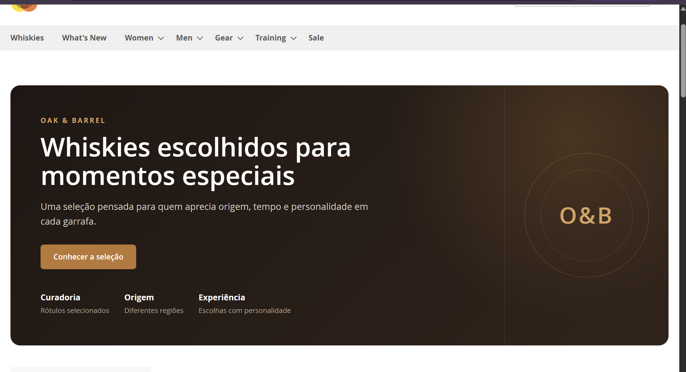
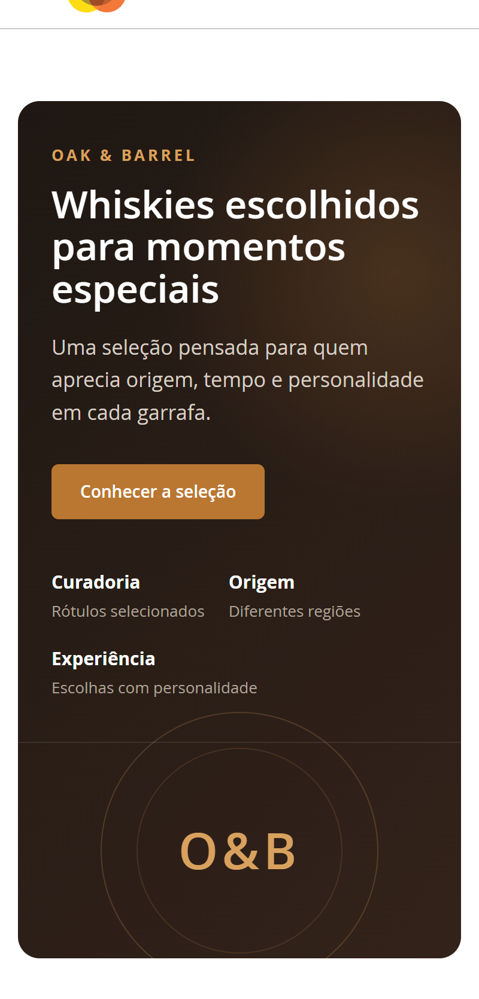
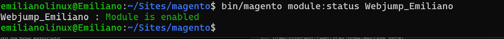
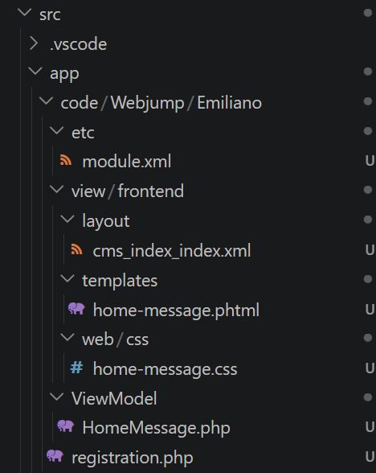
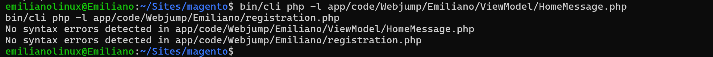

# 🧩 Desafio 13.1 — Primeiro módulo com bloco na Home

> Criação de um módulo Magento do zero, utilizando Layout XML, ViewModel, template `.phtml` e CSS próprio.

---

## 📋 Informações do desafio

| Item | Informação |
|---|---|
| Sprint | Sprint 6 — Magento 2 |
| Semana | 13 |
| Desafio | 13.1 — Primeiro módulo com bloco na Home |
| Prioridade | Obrigatório |
| Magento | Open Source 2.4.8-p1 |
| Módulo | `Webjump_Emiliano` |
| Branch | `exercicio/13.1-first-module` |
| Ambiente | Local / Developer |

---

# 🎯 Objetivo

O objetivo deste desafio foi criar um módulo Magento do zero e exibir um bloco próprio na página inicial da loja.

A implementação foi feita separando as responsabilidades entre:

```text
Layout XML
↓
ViewModel
↓
Template
↓
CSS
```

Para manter continuidade com o exercício anterior, o bloco recebeu a identidade fictícia **Oak & Barrel**, utilizada na loja de whiskies criada na Semana 12.

---

# ✅ Critérios de aceite

| Critério | Status |
|---|:---:|
| Módulo ativo no Magento | ✅ |
| Bloco exibido na Home | ✅ |
| Lógica concentrada no ViewModel | ✅ |
| Template utilizado apenas para apresentação | ✅ |
| Saídas escapadas | ✅ |
| CSS próprio aplicado ao bloco | ✅ |
| Estrutura do módulo documentada | ✅ |

---

# 📁 Estrutura do módulo

O módulo foi criado em:

```text
src/app/code/Webjump/Emiliano/
```

Estrutura final:

```text
Webjump/Emiliano
├── registration.php
├── etc/
│   └── module.xml
├── ViewModel/
│   └── HomeMessage.php
└── view/
    └── frontend/
        ├── layout/
        │   └── cms_index_index.xml
        ├── templates/
        │   └── home-message.phtml
        └── web/
            └── css/
                └── home-message.css
```

Cada arquivo possui uma responsabilidade específica dentro do módulo.

---

# ⚙️ Registro do módulo

O arquivo:

```text
registration.php
```

registra o módulo na aplicação Magento.

Foi utilizado:

```php
ComponentRegistrar::register(
    ComponentRegistrar::MODULE,
    'Webjump_Emiliano',
    __DIR__
);
```

Já o arquivo:

```text
etc/module.xml
```

declara o módulo:

```xml
<module name="Webjump_Emiliano"/>
```

Depois da criação, o módulo foi habilitado através de:

```bash
bin/magento module:enable Webjump_Emiliano
bin/magento setup:upgrade
```

A validação foi realizada com:

```bash
bin/magento module:status Webjump_Emiliano
```

---

# 🧠 ViewModel

A lógica utilizada pelo bloco foi criada em:

```text
ViewModel/HomeMessage.php
```

O ViewModel fornece os dados necessários para a apresentação, como:

- identificação da marca;
- título;
- descrição;
- texto do botão;
- URL do botão;
- destaques do componente.

Exemplo:

```php
public function getTitle(): string
{
    return 'Whiskies escolhidos para momentos especiais';
}
```

Também foi utilizado um método que retorna os destaques exibidos no bloco:

```php
public function getHighlights(): array
{
    return [
        [
            'title' => 'Curadoria',
            'text' => 'Rótulos selecionados',
        ],
        [
            'title' => 'Origem',
            'text' => 'Diferentes regiões',
        ],
        [
            'title' => 'Experiência',
            'text' => 'Escolhas com personalidade',
        ],
    ];
}
```

Dessa forma, os dados ficam separados da camada de apresentação.

---

# 🖼️ Template `.phtml`

O arquivo:

```text
view/frontend/templates/home-message.phtml
```

é responsável apenas por apresentar os dados recebidos do ViewModel.

O ViewModel é obtido através do bloco:

```php
$viewModel = $block->getData('view_model');
```

e os métodos são utilizados somente durante a renderização.

Exemplo:

```php
<?= $block->escapeHtml($viewModel->getTitle()) ?>
```

Não foi adicionada regra de negócio ao template.

---

# 🔐 Escape de saída

Todas as informações dinâmicas apresentadas no template passam por métodos de escape.

Para textos foi utilizado:

```php
$block->escapeHtml()
```

Para URLs:

```php
$block->escapeUrl()
```

Exemplo:

```php
<a href="<?= $block->escapeUrl($viewModel->getCtaUrl()) ?>">
    <?= $block->escapeHtml($viewModel->getCtaLabel()) ?>
</a>
```

Isso evita que valores sejam inseridos diretamente no HTML sem tratamento.

---

# 🗺️ Layout XML

O bloco foi inserido na Home através de:

```text
view/frontend/layout/cms_index_index.xml
```

O nome `cms_index_index.xml` representa o layout utilizado pela página inicial CMS do Magento.

O bloco foi adicionado ao container:

```xml
<referenceContainer name="content">
```

utilizando:

```xml
<block class="Magento\Framework\View\Element\Template"
       name="webjump.emiliano.home.message"
       template="Webjump_Emiliano::home-message.phtml">
```

O ViewModel foi associado ao bloco por meio de:

```xml
<arguments>
    <argument name="view_model"
              xsi:type="object">Webjump\Emiliano\ViewModel\HomeMessage</argument>
</arguments>
```

O fluxo final ficou:

```text
cms_index_index.xml
↓
cria o bloco
↓
injeta HomeMessage
↓
home-message.phtml
↓
renderiza o conteúdo
```

---

# 🎨 CSS próprio

O estilo do componente foi criado em:

```text
view/frontend/web/css/home-message.css
```

e carregado pelo próprio layout:

```xml
<head>
    <css src="Webjump_Emiliano::css/home-message.css"/>
</head>
```

O bloco recebeu uma identidade visual inspirada na proposta da **Oak & Barrel**, utilizando:

- fundo escuro;
- tons de âmbar;
- CTA destacado;
- seção de destaques;
- monograma `O&B`;
- layout responsivo.

O CSS é aplicado somente às classes do componente, evitando alterações globais desnecessárias no tema Luma.

---

# 📱 Responsividade

Também foi adicionada uma adaptação para telas menores:

```css
@media (max-width: 768px) {
    .oak-barrel-feature {
        grid-template-columns: 1fr;
    }
}
```

No desktop, o componente utiliza duas áreas principais.

No mobile, o conteúdo passa a ser organizado em uma única coluna.

---

# 🧪 Validação

A sintaxe dos arquivos PHP foi validada dentro do container.

Foram executados:

```bash
bin/cli php -l app/code/Webjump/Emiliano/ViewModel/HomeMessage.php
bin/cli php -l app/code/Webjump/Emiliano/registration.php
```

Resultado:

```text
No syntax errors detected
```

Também foi confirmado que o módulo permanece habilitado:

```bash
bin/magento module:status Webjump_Emiliano
```

---

# 🧯 Troubleshooting

Durante o desenvolvimento foram encontrados alguns pontos relacionados ao ambiente e à integração do módulo.

---

## ⚠️ Validação de URN no VS Code

### Sintoma

O VS Code apresentava erro no `module.xml`:

```text
Cannot find the declaration of element 'config'
```

O módulo funcionava normalmente no Magento, mas o editor não conseguia resolver o schema XML.

### Solução

Foi gerado o catálogo de URNs do Magento:

```bash
bin/magento dev:urn-catalog:generate --ide=vscode .vscode/magento-urn-catalog.xml
```

O projeto também passou a ser aberto diretamente no ambiente:

```text
WSL: Ubuntu-22.04
```

permitindo que o VS Code acessasse corretamente os arquivos do Magento dentro do filesystem Linux.

### ✅ Resultado

A validação XML passou a reconhecer corretamente os schemas do Magento.

---

## ⚠️ Código customizado ignorado pelo Git

### Sintoma

Os arquivos criados em:

```text
src/app/code/
```

não apareciam no Git porque o `.gitignore` possuía:

```text
src/
```

ignorando todo o diretório Magento.

### Solução

O `.gitignore` foi ajustado para continuar ignorando os arquivos gerados e dependências do Magento, mas permitir o versionamento de:

```text
src/app/code/**
```

O diretório:

```text
src/vendor/
```

permaneceu ignorado.

### ✅ Resultado

O módulo passou a ser versionado sem incluir dependências ou arquivos gerados pelo Magento.

---

# 📸 Evidências

As evidências do desafio estão armazenadas em:

```text
docs/images/13.1/
```

---

## 🖥️ Bloco na Home

Arquivo:

```text
docs/images/13.1/home-block.png
```



> Bloco desenvolvido pelo módulo `Webjump_Emiliano` sendo exibido na página inicial.

---

## 📱 Responsividade

Arquivo:

```text
docs/images/13.1/mobile-responsive.png
```



> Evidência da adaptação do componente para telas menores.

---

## ✅ Módulo habilitado

Arquivo:

```text
docs/images/13.1/module-enabled.png
```



> Resultado do comando `module:status` confirmando que `Webjump_Emiliano` está ativo.

---

## 📁 Estrutura do módulo

Arquivo:

```text
docs/images/13.1/module-structure.png
```



> Estrutura de pastas e arquivos criada em `app/code/Webjump/Emiliano`.

---

## 🧪 Validação PHP

Arquivo:

```text
docs/images/13.1/php-validation.png
```



> Validação de sintaxe dos arquivos PHP do módulo.

---

# 💡 Aprendizados

O desafio permitiu entender melhor o fluxo de renderização de um módulo Magento.

A estrutura utilizada pode ser resumida como:

```text
Layout XML
↓
ViewModel
↓
Template
↓
HTML
```

O Layout XML define onde o bloco será exibido.

O ViewModel fornece os dados necessários.

O `.phtml` apresenta esses dados.

O CSS define a identidade visual do componente.

Também ficou clara a importância de manter a lógica fora do template e de escapar todo conteúdo dinâmico antes de renderizá-lo.

---

# ✅ Resultado final

Ao final do desafio, o módulo ficou estruturado da seguinte forma:

```text
Webjump_Emiliano
│
├── Registro do módulo ✅
├── module.xml ✅
├── ViewModel ✅
├── Layout XML ✅
├── Template .phtml ✅
├── Escape de saída ✅
├── CSS próprio ✅
├── Responsividade ✅
└── Bloco exibido na Home ✅
```

O **Desafio 13.1** foi concluído com o módulo ativo e o bloco funcionando na página inicial da loja.

---

## ➡️ Próximo desafio

[13.2 — Estendendo o comportamento do catálogo](13.2-catalog-extension.md)