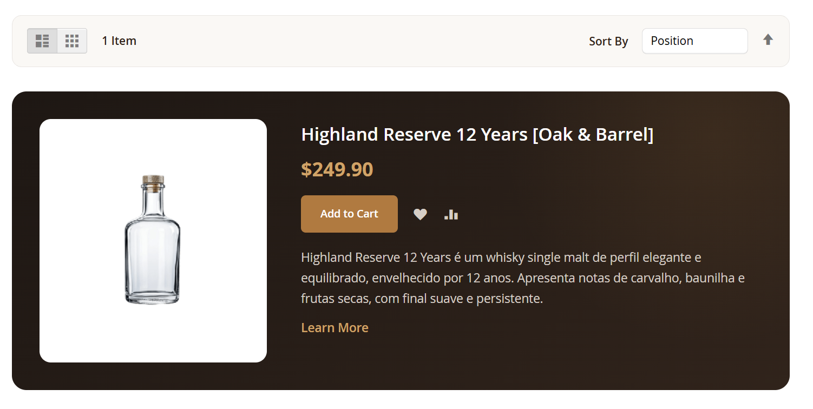
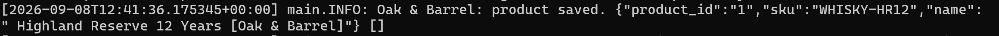
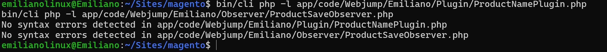
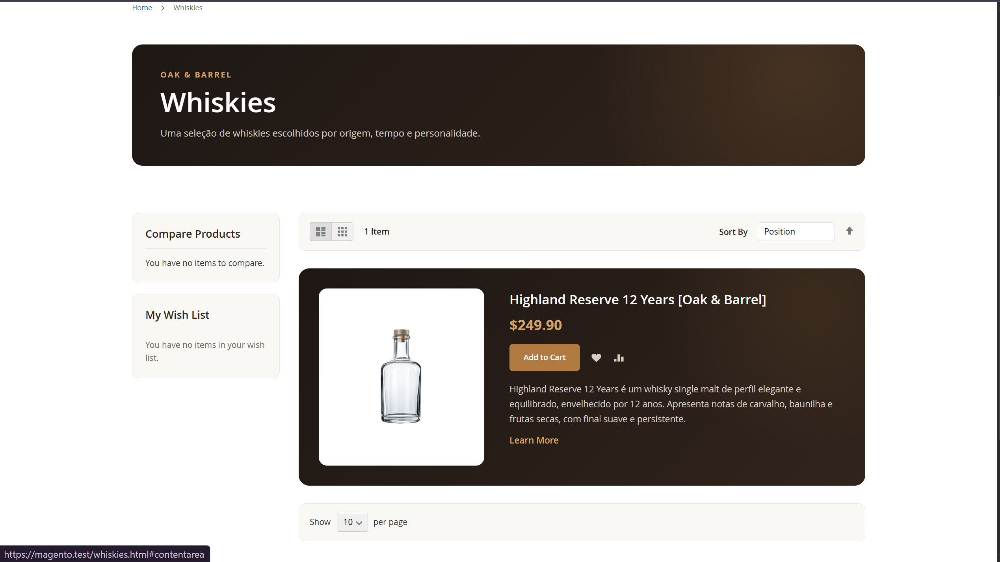
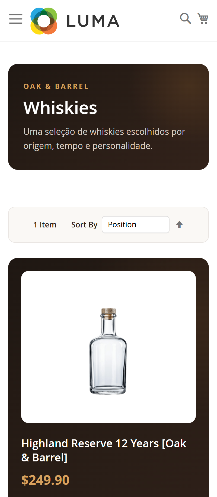

# 🔌 13.2 — Extensão do Catálogo

> Evolução do módulo `Webjump_Emiliano` com Plugin, Observer e melhorias visuais no catálogo.

---

## 🎯 Objetivo

Estender o comportamento do catálogo utilizando mecanismos oficiais do Magento, sem alterar arquivos em `vendor/`.

Foram implementados:

- Plugin `after`;
- configuração em `di.xml`;
- Observer;
- configuração em `events.xml`;
- Dependency Injection;
- registro em log;
- refinamento visual da categoria `Whiskies`.

---

## 🔌 Plugin

Foi criado:

```text
Plugin/ProductNamePlugin.php
```

O Plugin intercepta:

```text
Magento\Catalog\Model\Product::getName()
```

através de:

```text
afterGetName()
```

O produto:

```text
Highland Reserve 12 Years
```

passa a ser exibido como:

```text
Highland Reserve 12 Years [Oak & Barrel]
```

A declaração foi realizada em:

```text
etc/di.xml
```

---

## 👁️ Observer

Foi criado:

```text
Observer/ProductSaveObserver.php
```

O Observer reage ao evento:

```text
catalog_product_save_after
```

declarado em:

```text
etc/events.xml
```

Ao salvar um produto no Admin, são registradas no `system.log` informações como:

```text
product_id
sku
name
```

O `LoggerInterface` é recebido através de Dependency Injection.

---

## 🧠 Plugin x Observer

| Mecanismo | Função |
|---|---|
| Plugin | Intercepta e modifica o resultado de um método |
| Observer | Reage a um evento disparado pelo Magento |

---

## 🎨 Refinamento visual

Como melhoria adicional, a categoria `Whiskies` recebeu uma identidade visual baseada na **Oak & Barrel**.

Foram adicionados:

```text
view/frontend/layout/default.xml
view/frontend/layout/catalog_category_view.xml
view/frontend/web/css/oak-barrel-base.css
view/frontend/web/css/whisky-category.css
```

O `oak-barrel-base.css` concentra estilos compartilhados, enquanto o `whisky-category.css` contém os ajustes específicos da categoria.

Os estilos utilizam:

```css
body.category-whiskies
```

evitando alterações nas demais categorias.

### Melhorias

- cabeçalho da categoria;
- toolbar;
- sidebar;
- card do produto;
- imagem;
- preço;
- CTA;
- responsividade.

---

## 📸 Evidências

### Plugin



### Observer



### Validação PHP



### Desktop



### Mobile



---

## ✅ Resultado

- [x] Plugin `after`
- [x] `di.xml`
- [x] Observer
- [x] `events.xml`
- [x] Log validado
- [x] Alteração visível na storefront
- [x] Categoria estilizada
- [x] Layout responsivo
- [x] Nenhum arquivo em `vendor/` alterado

---

## 📌 Status

```text
13.2
├── Plugin             ✅
├── Observer           ✅
├── Log                ✅
├── Visual             ✅
└── Responsividade     ✅
```