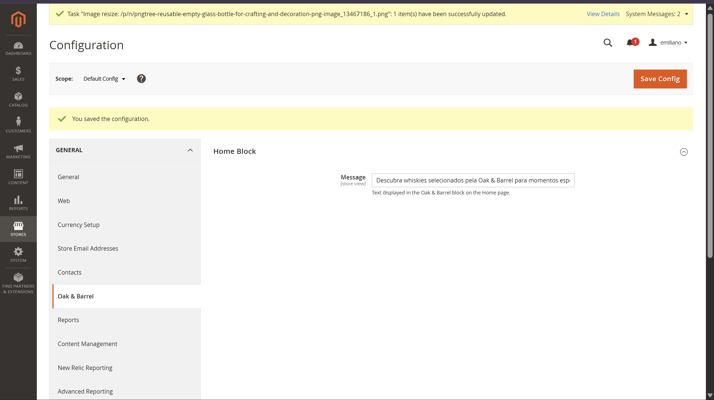
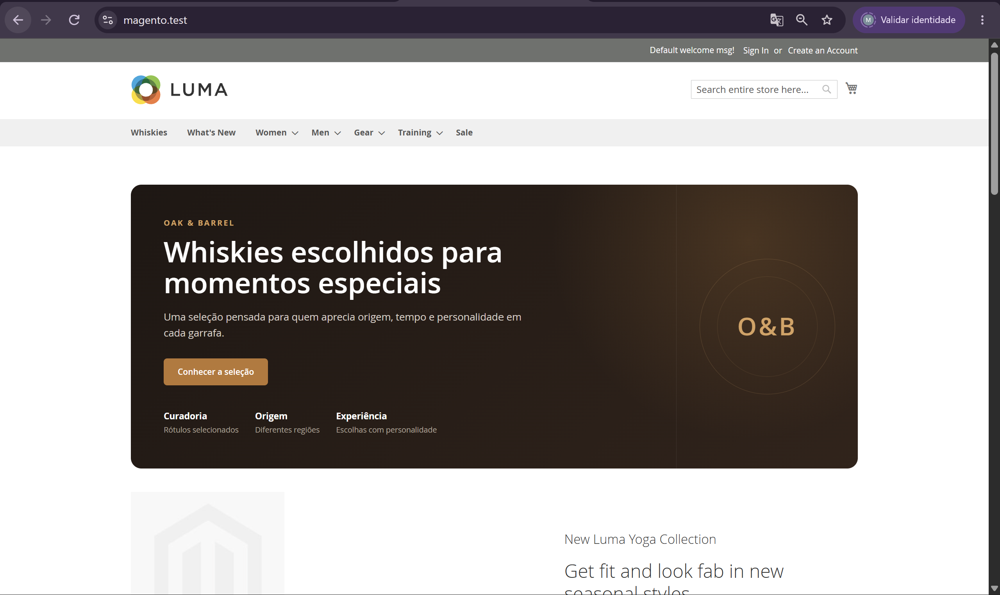
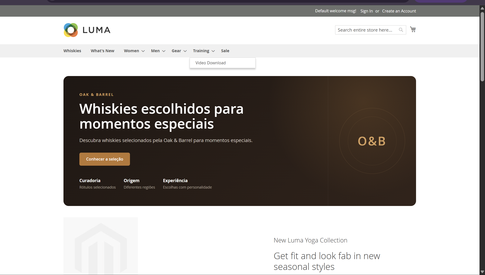
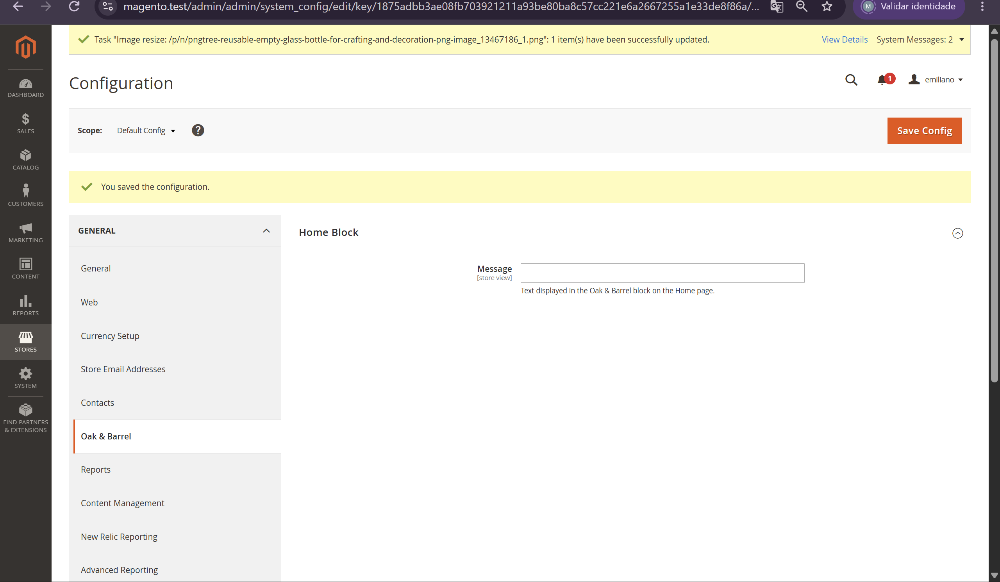
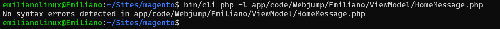

# ⚙️ 13.3 — Configuração no Admin

> Evolução do módulo `Webjump_Emiliano` para permitir a edição do conteúdo da Home através do Magento Admin.

---

## 🎯 Objetivo

Permitir que o texto exibido no bloco Oak & Barrel da Home seja configurado através de:

```text
Stores → Configuration
```

sem necessidade de alterar código.

Foram implementados:

- `system.xml`;
- `config.xml`;
- campo configurável no Admin;
- leitura da configuração pelo ViewModel;
- Dependency Injection com `ScopeConfigInterface`;
- valor padrão;
- fallback para campo vazio.

---

## ⚙️ Configuração no Admin

Foi criado:

```text
etc/adminhtml/system.xml
```

O arquivo adiciona uma nova configuração em:

```text
Stores
→ Configuration
→ General
→ Oak & Barrel
→ Home Block
→ Message
```

O campo permite alterar diretamente o texto exibido no bloco da Home.

O caminho interno da configuração é:

```text
webjump_emiliano/home/message
```

---

## 📄 Valor padrão

Foi criado:

```text
etc/config.xml
```

para definir o valor padrão da mensagem.

O texto inicial é:

```text
Uma seleção pensada para quem aprecia origem, tempo e personalidade em cada garrafa.
```

Dessa forma, a configuração possui um valor mesmo antes de qualquer alteração pelo Admin.

---

## 🧠 ViewModel

O `HomeMessage.php` foi atualizado para utilizar:

```text
Magento\Framework\App\Config\ScopeConfigInterface
```

através de Dependency Injection.

A mensagem é obtida pelo caminho:

```text
webjump_emiliano/home/message
```

Fluxo:

```text
Stores → Configuration
        ↓
ScopeConfigInterface
        ↓
HomeMessage
        ↓
home-message.phtml
        ↓
Home
```

---

## 🛡️ Fallback

Também foi implementado um fallback para evitar problemas caso o campo seja salvo vazio.

O comportamento é:

```text
Campo preenchido
→ exibe o valor configurado

Campo vazio
→ exibe a mensagem padrão
```

Assim, o componente continua funcionando mesmo sem conteúdo salvo no campo.

---

## 🧪 Validação

O comportamento foi validado em três situações:

### Valor padrão

A Home exibiu corretamente a mensagem definida em:

```text
etc/config.xml
```

### Valor alterado

O texto foi modificado pelo Admin para:

```text
Descubra whiskies selecionados pela Oak & Barrel para momentos especiais.
```

Após salvar a configuração e limpar o cache, a nova mensagem foi exibida na Home.

### Campo vazio

O campo foi salvo sem conteúdo.

Nesse cenário, o bloco continuou funcionando e voltou a exibir a mensagem padrão.

---

## 📸 Evidências

### Configuração no Admin



---

### Frontend antes da alteração



---

### Frontend após alteração



---

### Campo vazio com fallback



---

### Validação PHP



---

## ✅ Resultado

- [x] `system.xml`
- [x] campo disponível no Admin
- [x] `config.xml`
- [x] valor padrão
- [x] leitura via ViewModel
- [x] `ScopeConfigInterface`
- [x] alteração refletida na Home
- [x] fallback para campo vazio
- [x] sintaxe PHP validada
- [x] nenhum arquivo em `vendor/` alterado

---

## 📌 Status

```text
13.3
├── Configuração Admin    ✅
├── Valor padrão          ✅
├── ViewModel             ✅
├── Dependency Injection  ✅
├── Alteração na Home     ✅
└── Fallback              ✅
```