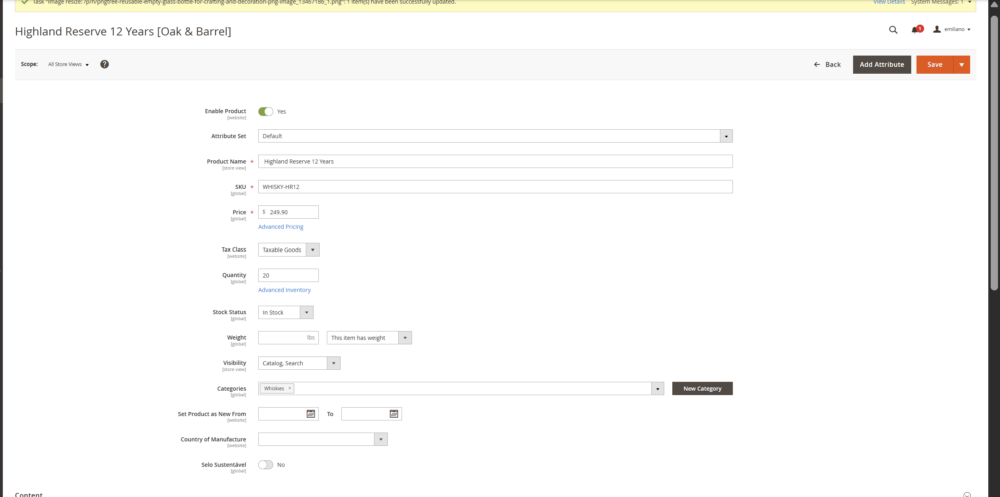
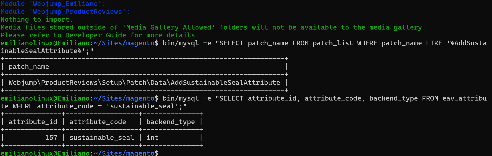
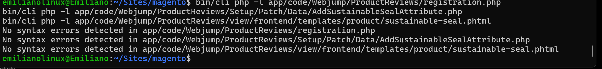
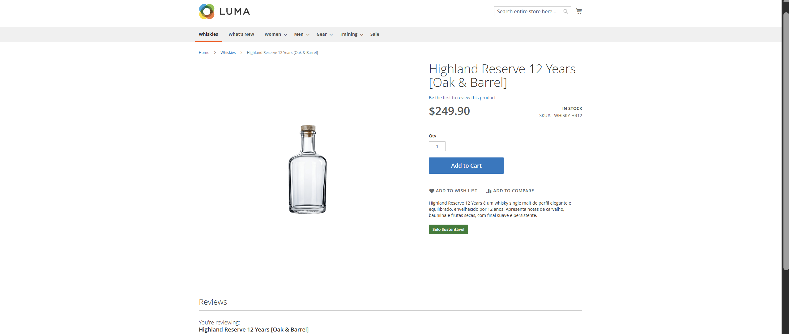
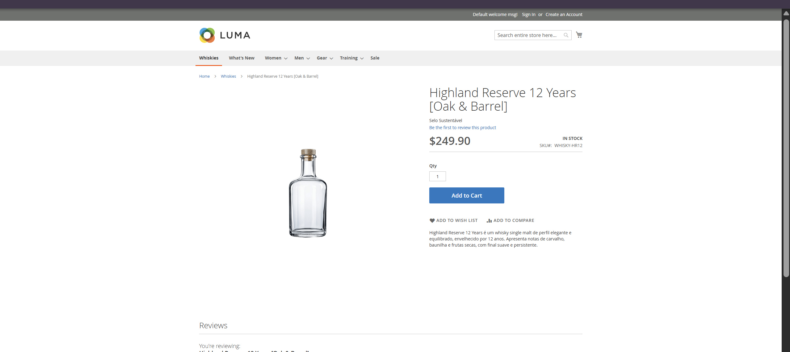

# ⚙️ 14.1 — Atributo de Produto por Código

> Implementação de um atributo customizado de produto através de Data Patch no módulo `Webjump_ProductReviews`, com exibição condicional de um selo na página do produto.

---

## 🎯 Objetivo

Permitir que produtos possam ser identificados com o atributo:

```text
Selo Sustentável
```

sem necessidade de criar o campo manualmente em cada ambiente.

Foram implementados:

- Data Patch para criação do atributo;
- atributo booleano `sustainable_seal`;
- escopo global;
- registro automático em `patch_list`;
- campo disponível no Admin;
- exibição condicional na página do produto;
- template próprio;
- LESS próprio para o selo;
- tratamento para produto sem o atributo marcado.

---

## 🧩 Data Patch

Foi criado:

```text
Setup/Patch/Data/AddSustainableSealAttribute.php
```

O Data Patch utiliza:

```text
EavSetupFactory
```

para criar o atributo diretamente na entidade de produto do Magento.

Configuração principal:

```text
Código: sustainable_seal
Rótulo: Selo Sustentável
Tipo: int
Input: boolean
Obrigatório: não
Escopo: Global
Valor padrão: No
```

O atributo é criado automaticamente ao executar:

```bash
bin/magento setup:upgrade
```

Após sua execução, o Magento registra o patch na tabela:

```text
patch_list
```

Isso impede que o mesmo patch seja executado novamente na mesma instalação.

---

## 🧠 Decisão Técnica — Escopo do Atributo

Foi utilizado:

```text
SCOPE_GLOBAL
```

porque `sustainable_seal` representa uma característica do produto/SKU e não uma informação específica de Website ou Store View.

O mesmo produto pode existir em diferentes estoques ou lotes sem deixar de representar o mesmo SKU. Por exemplo, dois lotes podem possuir quantidades ou datas de validade diferentes, mas continuam sendo unidades do mesmo produto.

Essas diferenças pertencem à gestão de estoque ou a entidades próprias de lote e não justificam alterar a característica de sustentabilidade do produto entre Store Views.

Caso existissem versões realmente diferentes do produto, com composição, processo produtivo ou características de sustentabilidade distintas, a modelagem mais adequada seria tratá-las como produtos/SKUs diferentes ou criar uma entidade específica para essa variação.

Por isso, para este cenário, o escopo global evita configurações contraditórias e mantém o atributo associado à identidade do produto.

---

## 🛒 Atributo no Admin

Após a execução do Data Patch, o campo passou a aparecer na edição do produto como:

```text
Selo Sustentável
```

O campo utiliza uma opção:

```text
Yes / No
```

e pode ser configurado diretamente pelo administrador da loja.

O atributo não foi adicionado à grade geral de produtos, pois o requisito atual é utilizá-lo apenas na página individual do produto.

---

## 🧱 Layout

Foi criado:

```text
view/frontend/layout/catalog_product_view.xml
```

Esse Layout XML adiciona o bloco responsável pelo selo somente na página de detalhes do produto.

Fluxo:

```text
Página do Produto
        ↓
catalog_product_view.xml
        ↓
Magento\Catalog\Block\Product\View
        ↓
sustainable-seal.phtml
```

O Layout XML é responsável apenas por declarar a inclusão do bloco na estrutura da PDP.

A estilização permanece separada na camada de frontend do módulo.

---

## 📄 Template

Foi criado:

```text
view/frontend/templates/product/sustainable-seal.phtml
```

O template obtém o produto atual através do bloco da PDP e consulta:

```text
sustainable_seal
```

Comportamento:

```text
Selo Sustentável = Yes
→ renderiza o selo

Selo Sustentável = No
→ não renderiza conteúdo
```

Dessa forma, produtos sem o atributo marcado continuam sendo exibidos normalmente.

O texto exibido também utiliza:

```text
escapeHtml()
```

para manter a saída protegida.

---

## 🎨 Estilização

Foi criado:

```text
view/frontend/web/css/source/_module.less
```

O arquivo concentra os estilos frontend pertencentes ao módulo `Webjump_ProductReviews`.

O estilo é processado pelo fluxo LESS do Magento, sem necessidade de carregar um arquivo CSS individual diretamente pelo Layout XML.

A separação ficou:

```text
catalog_product_view.xml
→ estrutura e posicionamento

sustainable-seal.phtml
→ conteúdo e condição de exibição

_module.less
→ apresentação visual
```

O selo utiliza:

```text
fundo verde
texto branco
sem borda
```

para diferenciar visualmente produtos marcados como sustentáveis.

---

## 🧪 Validação

O comportamento foi validado em diferentes etapas.

### Data Patch

Após executar:

```bash
bin/magento setup:upgrade
```

o patch foi registrado corretamente na tabela:

```text
patch_list
```

### Atributo EAV

O atributo foi localizado na tabela:

```text
eav_attribute
```

com:

```text
attribute_code = sustainable_seal
backend_type = int
```

### Produto com selo

Com:

```text
Selo Sustentável = Yes
```

o selo é exibido corretamente na página do produto.

### Produto sem selo

Com:

```text
Selo Sustentável = No
```

nenhum selo é renderizado e a página continua funcionando normalmente.

### LESS

Após a migração do CSS para `_module.less`, os arquivos estáticos e preprocessados foram limpos:

```bash
bin/cli rm -rf pub/static/frontend/*
bin/cli rm -rf var/view_preprocessed/*
bin/magento cache:clean
```

A página do produto foi novamente validada.

O selo continuou sendo exibido quando o atributo estava marcado e permaneceu oculto quando desativado.

### Validação PHP

Os arquivos PHP foram validados utilizando:

```bash
bin/cli php -l app/code/Webjump/ProductReviews/registration.php
bin/cli php -l app/code/Webjump/ProductReviews/Setup/Patch/Data/AddSustainableSealAttribute.php
bin/cli php -l app/code/Webjump/ProductReviews/view/frontend/templates/product/sustainable-seal.phtml
```

Nenhum erro de sintaxe foi identificado.

---

## 📸 Evidências

### Atributo no Admin



---

### Patch registrado



---

### Validação PHP



---

### Produto com selo



---

### Produto sem selo



---

## ✅ Resultado

- [x] atributo criado por Data Patch
- [x] `setup:upgrade` cria o atributo
- [x] patch registrado em `patch_list`
- [x] atributo disponível no Admin
- [x] rótulo em português
- [x] escopo definido e justificado
- [x] selo exibido quando marcado
- [x] produto funciona normalmente quando não marcado
- [x] Layout XML próprio
- [x] template próprio
- [x] LESS próprio
- [x] sintaxe PHP validada
- [x] nenhum arquivo em `vendor/` alterado

---

## 📌 Status

```text
14.1

├── Data Patch               ✅
├── Atributo EAV             ✅
├── Registro em patch_list   ✅
├── Campo no Admin           ✅
├── Decisão de escopo        ✅
├── Exibição na PDP          ✅
├── Template                 ✅
├── LESS                     ✅
├── Tratamento Yes / No      ✅
└── Evidências               ✅
```