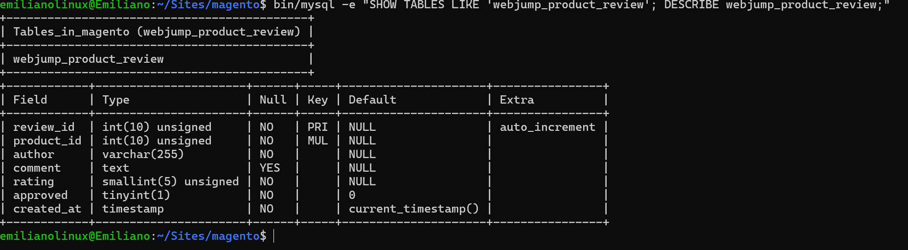
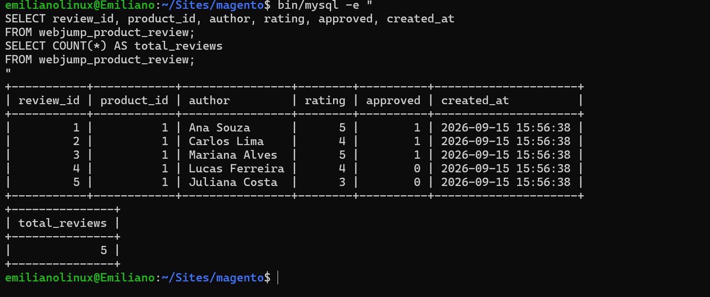
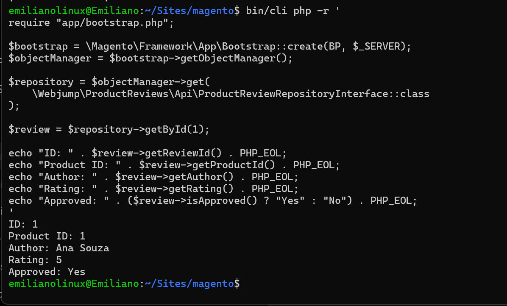
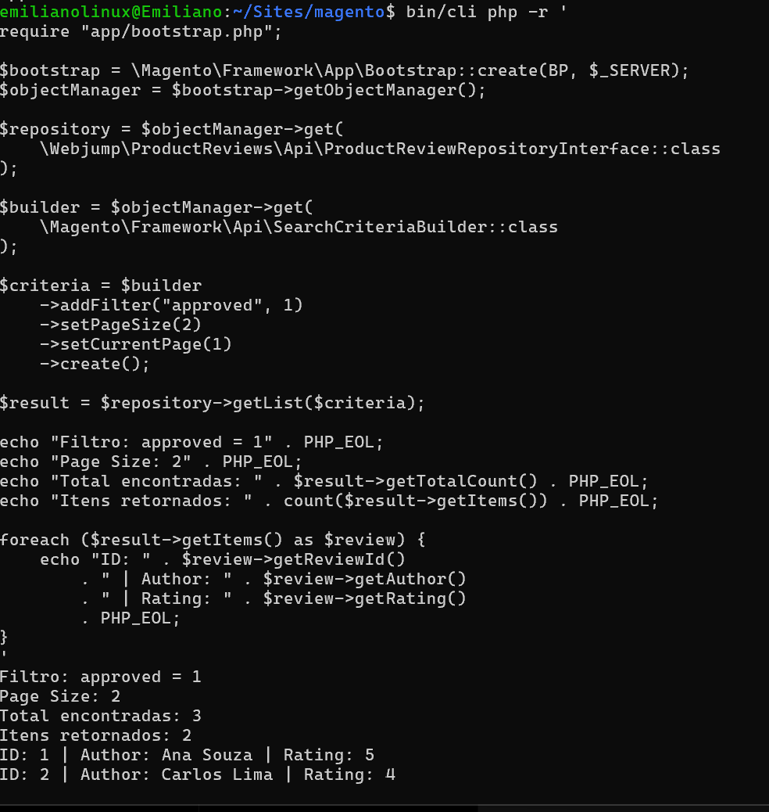
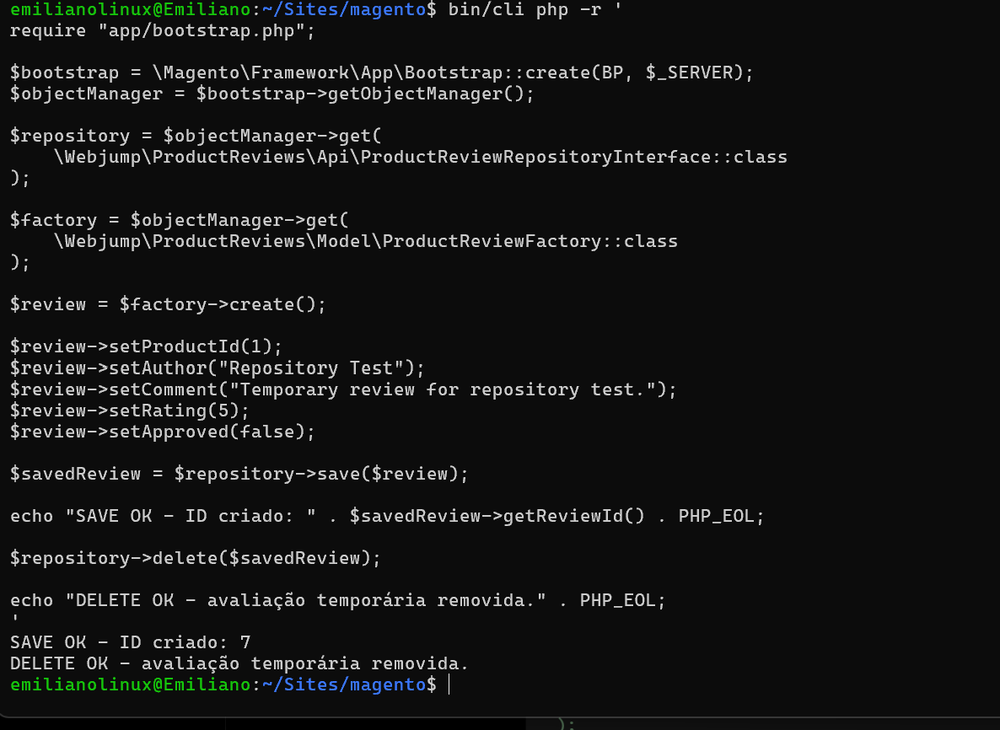
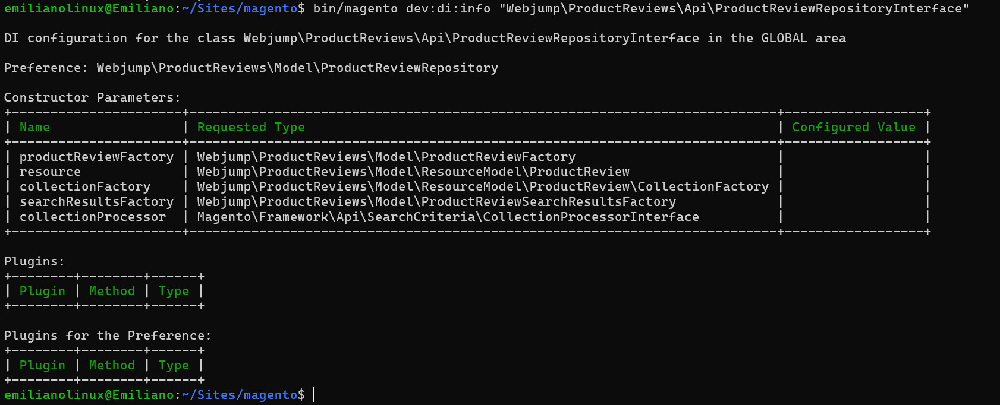
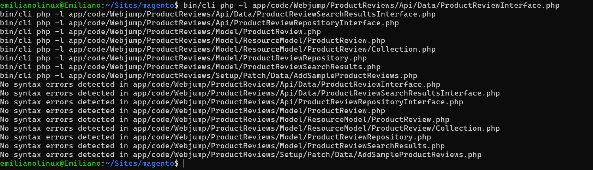

# 🗄️ 14.2 — Entidade Própria e Repository

> Evolução do módulo `Webjump_ProductReviews` com uma entidade própria de avaliações, utilizando Declarative Schema, Service Contracts e Repository.

---

## 🎯 Objetivo

Criar uma entidade própria para avaliações de produtos e disponibilizar acesso aos dados através de Repository.

Foram implementados:

- tabela própria com Declarative Schema;
- whitelist;
- Model;
- ResourceModel;
- Collection;
- Service Contracts;
- Repository;
- Dependency Injection;
- `SearchCriteria`;
- paginação e limite;
- Data Patch com 5 avaliações de exemplo.

---

## 🗄️ Estrutura de Dados

Foi criada a tabela:

```text
webjump_product_review
```

com os campos:

```text
review_id
product_id
author
comment
rating
approved
created_at
```

A estrutura é declarada em:

```text
etc/db_schema.xml
```

e a whitelist foi gerada em:

```text
etc/db_schema_whitelist.json
```

A tabela é criada através de:

```bash
bin/magento setup:upgrade
```

---

## 🧠 Decisão Técnica — Tabela Própria x EAV

Foi utilizada uma tabela própria porque avaliações são registros independentes relacionados a um produto.

Um produto pode possuir várias avaliações:

```text
Produto
├── Avaliação 1
├── Avaliação 2
└── Avaliação 3
```

Cada avaliação possui autor, comentário, nota, aprovação e data próprios.

Por isso:

```text
Característica única do produto
→ EAV

Vários registros independentes
→ tabela própria
```

---

## 🔗 Relacionamento com Produto

O campo:

```text
product_id
```

relaciona cada avaliação a um produto do catálogo.

Foi criado um índice BTREE nesse campo para melhorar consultas por produto.

Durante a modelagem, foi considerada a criação de uma foreign key entre:

```text
webjump_product_review.product_id
        ↓
catalog_product_entity.entity_id
```

com comportamento de restrição de exclusão.

No Declarative Schema do Magento, essa política poderia ser implementada com:

```text
onDelete="NO ACTION"
```

impedindo a exclusão física de um produto enquanto existirem avaliações relacionadas.

Essa abordagem aumentaria a integridade referencial e impediria avaliações apontando para produtos inexistentes.

Entretanto, a foreign key não foi adicionada neste exercício. O modelo proposto utiliza `product_id` indexado, mas não define como requisito uma política que impeça a exclusão física de produtos com avaliações.

Adicionar essa constraint introduziria uma nova regra de negócio:

```text
Produto possui avaliações
        ↓
tentativa de exclusão
        ↓
banco bloqueia a operação
```

Como esse comportamento não faz parte dos critérios atuais, foi mantida a modelagem mais próxima da proposta do exercício.

Uma foreign key com `NO ACTION` foi também considerada para preservar as avaliações e impedir a exclusão física dos produtos relacionados, contudo, para manter a modelagem mais próxima da proposta do exercício, também foi descartado.

## 🧱 Camada de Persistência

Foram criados:

```text
Model/ProductReview.php
Model/ResourceModel/ProductReview.php
Model/ResourceModel/ProductReview/Collection.php
```

Responsabilidades:

```text
Model
→ representa uma avaliação

ResourceModel
→ conecta a entidade à tabela

Collection
→ trabalha com várias avaliações
```

---

## 📑 Service Contracts e Repository

Foram criados:

```text
Api/Data/ProductReviewInterface.php
Api/ProductReviewRepositoryInterface.php
Api/Data/ProductReviewSearchResultsInterface.php
```

A implementação do Repository está em:

```text
Model/ProductReviewRepository.php
```

Métodos implementados:

```text
save()
getById()
delete()
getList()
```

O Repository centraliza o acesso aos dados e evita que outras camadas dependam diretamente do ResourceModel.

Os métodos `save()` e `delete()` recebem `ProductReviewInterface`, mantendo o Service Contract desacoplado da implementação concreta.

Quando necessário, o Repository normaliza a entidade recebida para o Model persistível antes de utilizar o ResourceModel, evitando exigir que o consumidor forneça diretamente uma instância de `ProductReview`.

---

## ⚙️ Dependency Injection

O arquivo:

```text
etc/di.xml
```

liga os contratos às implementações.

Principal configuração:

```text
ProductReviewRepositoryInterface
→ ProductReviewRepository
```

As `preference` utilizadas apontam apenas de interfaces próprias para classes próprias do módulo.

Nenhuma classe do núcleo do Magento foi substituída.

---

## 🔎 SearchCriteria e Limite

O método `getList()` utiliza:

```text
SearchCriteriaInterface
```

com suporte a filtros, paginação e limite.

Quando nenhum `pageSize` é informado, o Repository define no próprio `SearchCriteria` o limite padrão de:

```text
20 registros
```

quando nenhum `pageSize` é informado.

Teste realizado:

```text
approved = 1
pageSize = 2
currentPage = 1
```

Resultado:

```text
Total encontradas: 3
Itens retornados: 2
```

Isso confirma que o filtro e o limite foram respeitados.

---

## 🌱 Dados de Exemplo

Foi criado:

```text
Setup/Patch/Data/AddSampleProductReviews.php
```

O Data Patch insere 5 avaliações através do próprio Repository:

```text
3 aprovadas
2 não aprovadas
```

A busca pelo produto é limitada e o patch possui proteção contra duplicação dos registros de exemplo.

---

## 🧪 Validação

Foram validados:

- tabela e campos criados corretamente;
- 5 avaliações inseridas;
- `getById()` funcionando;
- `getList()` com filtro e paginação;
- `save()` funcionando;
- `delete()` funcionando;
- Dependency Injection resolvida;
- sintaxe PHP sem erros;
- compilação de DI concluída.

---

## 📸 Evidências

### Estrutura da tabela



---

### Avaliações de exemplo



---

### Repository — getById



---

### Repository — SearchCriteria



---

### Repository — save e delete




---

### Dependency Injection



---

### Validação PHP



---

## ✅ Resultado

- [x] Declarative Schema
- [x] whitelist
- [x] Model
- [x] ResourceModel
- [x] Collection
- [x] Service Contracts
- [x] Repository
- [x] `save()`
- [x] `getById()`
- [x] `delete()`
- [x] `getList()`
- [x] `SearchCriteria`
- [x] paginação e limite
- [x] Dependency Injection
- [x] 5 avaliações via Data Patch
- [x] nenhum arquivo em `vendor/` alterado

---

## 📌 Status

```text
14.2
├── Declarative Schema    ✅
├── Persistência          ✅
├── Service Contracts     ✅
├── Repository            ✅
├── SearchCriteria        ✅
├── Dados de exemplo      ✅
└── Evidências            ✅
```