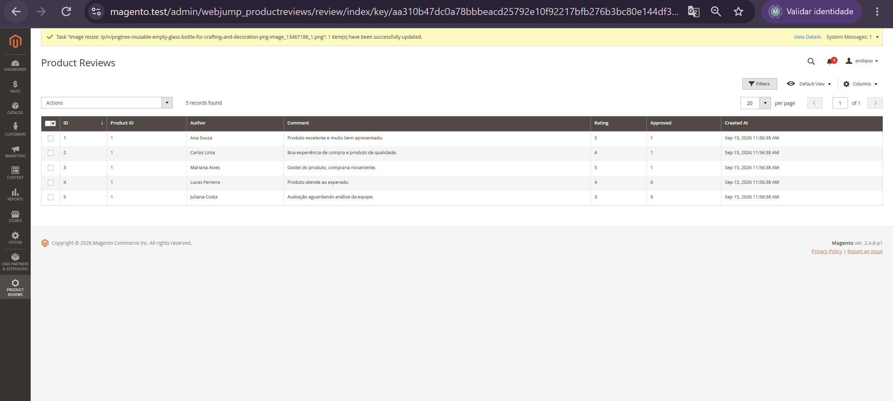
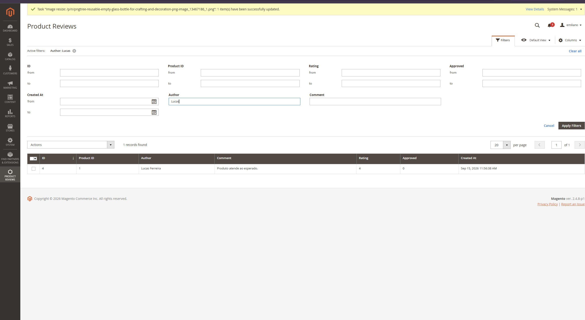
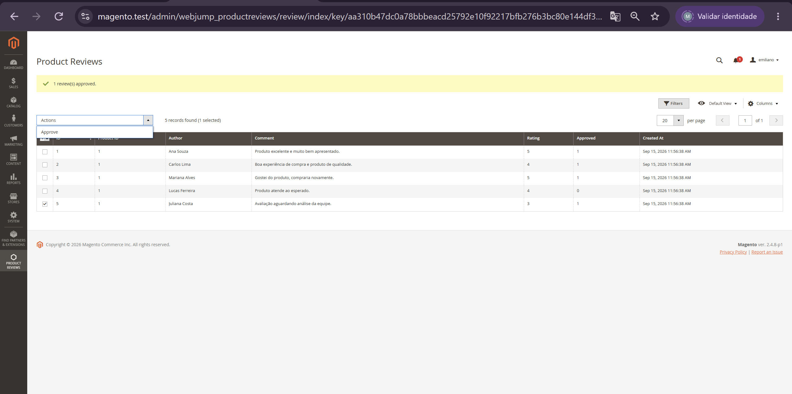
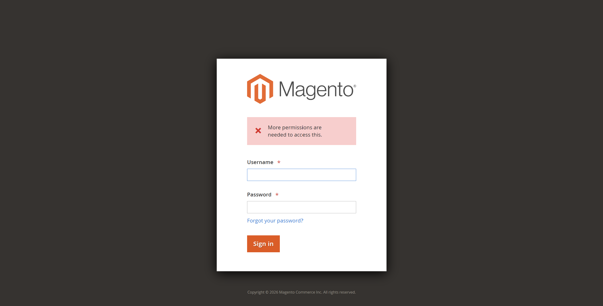

# 🧭 15.1 — Grid Administrativo

> Evolução do módulo `Webjump_ProductReviews` com uma interface administrativa para consulta e gerenciamento das avaliações cadastradas.

---

## 🎯 Objetivo

Disponibilizar no Magento Admin uma grid para visualizar e administrar os registros da entidade:

```text
webjump_product_review
```

Foram implementados:

- rota administrativa;
- item de menu;
- ACL;
- Controller com `ADMIN_RESOURCE`;
- UI Component Listing;
- Grid Collection;
- filtros;
- ordenação;
- paginação;
- seleção de registros;
- ação em massa para aprovação.

---

## 🧭 Rota e Menu

A rota administrativa foi registrada em:

```text
etc/adminhtml/routes.xml
```

com o `frontName`:

```text
webjump_productreviews
```

O menu foi criado em:

```text
etc/adminhtml/menu.xml
```

Estrutura no Admin:

```text
Product Reviews
└── Reviews
```

A opção direciona para:

```text
webjump_productreviews/review/index
```

---

## 🔐 ACL

As permissões foram declaradas em:

```text
etc/acl.xml
```

Foram separados os recursos:

```text
Webjump_ProductReviews::reviews
Webjump_ProductReviews::reviews_export
```

A separação permite controlar de forma independente o acesso ao gerenciamento das avaliações e a futura funcionalidade de exportação.

O Controller principal utiliza:

```php
public const ADMIN_RESOURCE = 'Webjump_ProductReviews::reviews';
```

Assim, o acesso à página também é validado no backend e não apenas pela visibilidade do menu.

---

## 🧱 Controller e Layout

O Controller principal está em:

```text
Controller/Adminhtml/Review/Index.php
```

Ele cria a página administrativa e define o título da tela.

O layout:

```text
view/adminhtml/layout/webjump_productreviews_review_index.xml
```

adiciona o UI Component:

```text
webjump_product_review_listing
```

ao container principal do Admin.

Fluxo:

```text
Menu
  ↓
Rota
  ↓
Index Controller
  ↓
Layout
  ↓
UI Component
  ↓
Grid
```

---

## 📊 Grid Administrativo

O Listing foi criado em:

```text
view/adminhtml/ui_component/webjump_product_review_listing.xml
```

São exibidas as colunas:

```text
ID
Product ID
Author
Comment
Rating
Approved
Created At
```

O grid também possui:

- ordenação;
- paginação;
- seleção de linhas;
- controle de colunas;
- filtros;
- ação em massa.

---

## 🔎 Filtros

Foram configurados diferentes tipos de filtro.

```text
Texto
→ Author
→ Comment

Faixa numérica
→ ID
→ Product ID
→ Rating
→ Approved

Faixa de data
→ Created At
```

Durante os testes foram validados filtros por autor, comentário, nota e data.

Exemplos:

```text
Author = Lucas
→ 1 registro

Rating = 5
→ 2 registros

Created At = 09/15/2026 até 09/15/2026
→ 5 registros
```

Uma faixa de data sem registros também foi testada e retornou corretamente:

```text
0 records found
```

---

## 🗄️ Grid Collection

Foi criada uma Collection específica para o Listing:

```text
Model/ResourceModel/ProductReview/Grid/Collection.php
```

Ela utiliza:

```text
Magento\Framework\View\Element\UiComponent\DataProvider\SearchResult
```

A configuração foi limitada à área administrativa através de:

```text
etc/adminhtml/di.xml
```

Configuração principal:

```text
mainTable
→ webjump_product_review

resourceModel
→ Webjump\ProductReviews\Model\ResourceModel\ProductReview

identifierName
→ review_id
```

O DataSource também utiliza:

```text
indexField = review_id
```

para identificar corretamente cada registro no provider do UI Component.

---

## ✅ Ação em Massa

Foi implementada a ação:

```text
Approve
```

através de:

```text
Controller/Adminhtml/Review/MassApprove.php
```

O fluxo é:

```text
Selecionar avaliações
        ↓
Actions → Approve
        ↓
MassApprove
        ↓
ProductReviewRepository
        ↓
approved = 1
```

O teste foi realizado com a avaliação de ID `5`.

Resultado:

```text
1 review(s) approved.
```

O valor apresentado no grid foi atualizado de:

```text
Approved = 0
```

para:

```text
Approved = 1
```

---

## 🔐 Teste de Permissão

Foi criado um perfil administrativo restrito sem acesso ao recurso:

```text
Webjump_ProductReviews::reviews
```

Ao tentar acessar diretamente a URL do grid, o Magento bloqueou a operação com a mensagem:

```text
More permissions are needed to access this.
```

Isso confirma que o `ADMIN_RESOURCE` e o ACL estão protegendo o Controller.

---

## 🛠️ Troubleshooting

Durante a implementação, o grid inicialmente permanecia carregando mesmo com a Collection retornando corretamente os 5 registros.

A configuração explícita do provider foi adicionada ao Listing:

```text
webjump_product_review_listing.webjump_product_review_listing_data_source
```

Depois disso, os registros passaram a ser renderizados.

Em seguida, as cinco linhas exibiam o último registro repetido.

O problema foi resolvido configurando:

```text
identifierName = review_id
```

na Grid Collection e:

```text
storageConfig
└── indexField = review_id
```

no DataSource.

Após o ajuste, os registros passaram a ser identificados individualmente:

```text
1 — Ana Souza
2 — Carlos Lima
3 — Mariana Alves
4 — Lucas Ferreira
5 — Juliana Costa
```

---

## 📸 Evidências

### Grid administrativo



---

### Filtros



---

### Aprovação em massa



---

### ACL — acesso negado



---

## ✅ Resultado

- [x] rota administrativa criada
- [x] item de menu criado
- [x] ACL configurada
- [x] permissão separada para exportação
- [x] Controller protegido por `ADMIN_RESOURCE`
- [x] UI Component Listing
- [x] Grid Collection
- [x] registros da entidade exibidos
- [x] filtros de texto
- [x] filtros numéricos
- [x] filtro por data
- [x] ordenação
- [x] paginação
- [x] ação em massa
- [x] acesso negado para perfil sem permissão
- [x] nenhum arquivo em `vendor/` alterado

---

## 📌 Status

```text
15.1

├── Rota administrativa      ✅
├── Menu                     ✅
├── ACL                      ✅
├── ADMIN_RESOURCE           ✅
├── UI Component             ✅
├── Grid Collection          ✅
├── Filtros                  ✅
├── Ordenação e paginação    ✅
├── Mass Action              ✅
├── Teste de permissão       ✅
└── Evidências               ✅
```