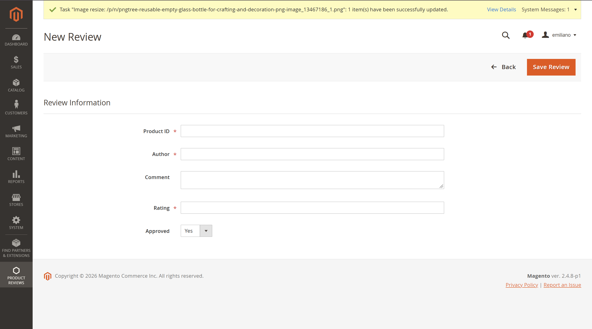
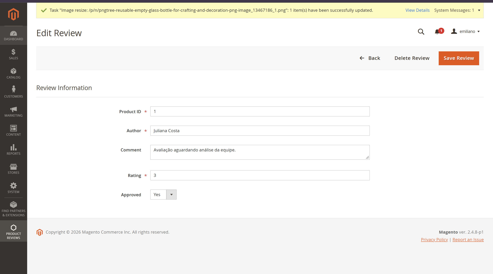
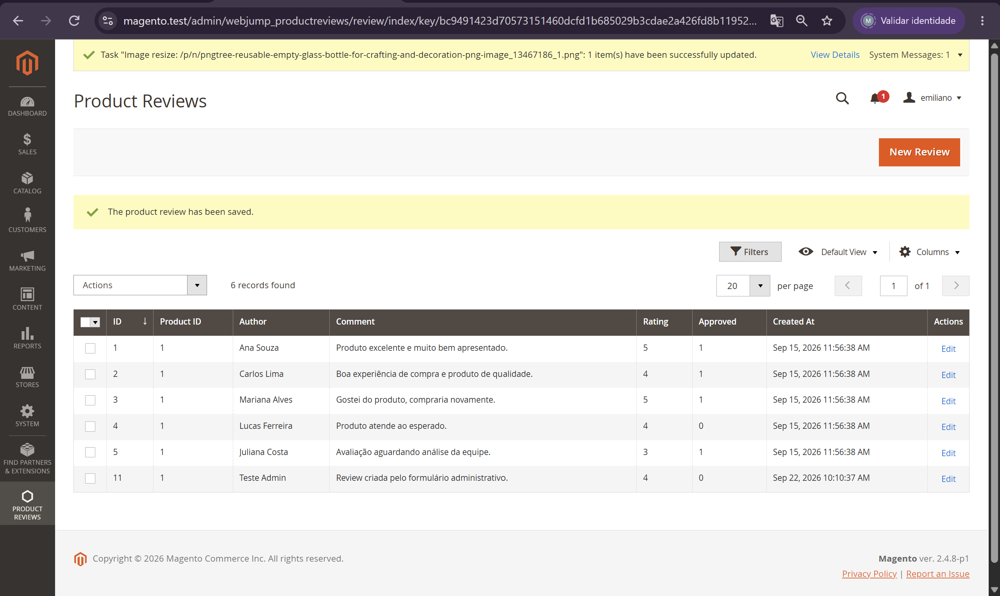
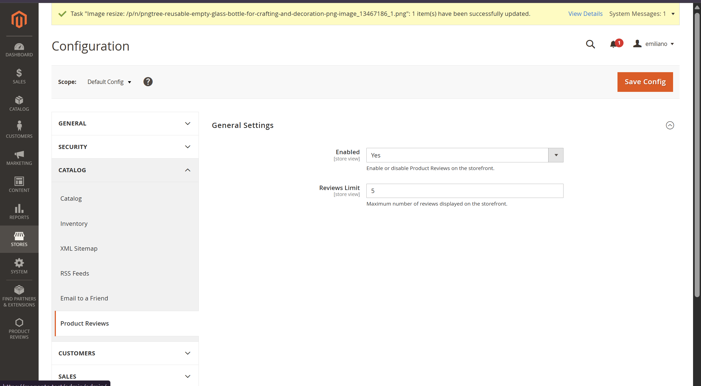
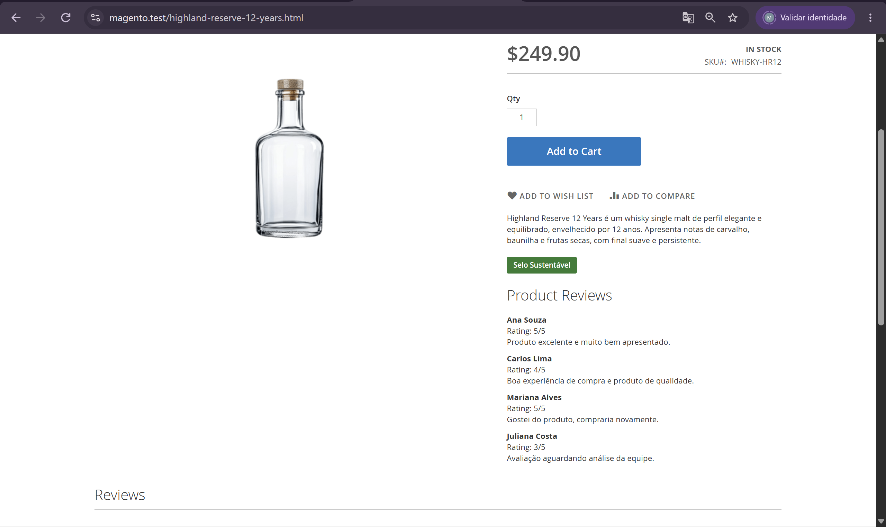
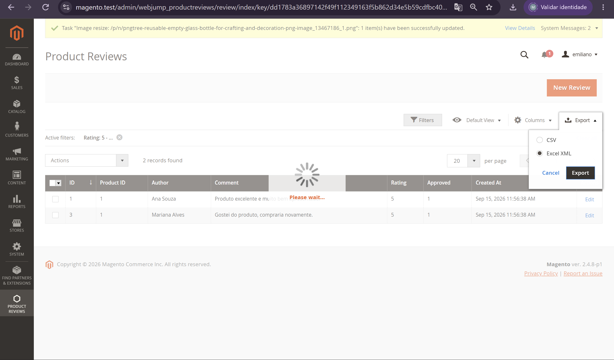

# 🧭 15.2 — Formulário, Configuração e Exportação

> Evolução do módulo `Webjump_ProductReviews` com CRUD administrativo, configuração por escopo e exportação dos registros em CSV e Excel XML.

---

## 🎯 Objetivo

Completar o gerenciamento administrativo da entidade:

```text
webjump_product_review
```

Foram implementados:

- formulário de criação;
- formulário de edição;
- validação dos dados;
- exclusão de avaliações;
- persistência através do Repository;
- configuração no Magento Admin;
- consumo das configurações no storefront;
- exportação CSV;
- exportação Excel XML;
- exportação respeitando os filtros do grid.

---

## 📝 Formulário Administrativo

O formulário foi criado através de UI Components em:

```text
view/adminhtml/ui_component/webjump_product_review_form.xml
```

Ele permite criar e editar avaliações utilizando os campos:

```text
Product ID
Author
Comment
Rating
Approved
```

O campo `review_id` também é utilizado internamente durante a edição.

---

## 📦 DataProvider

O formulário utiliza:

```text
Model/ProductReview/DataProvider.php
```

O DataProvider é responsável por disponibilizar os dados da entidade para o UI Component.

Fluxo de edição:

```text
Edit
  ↓
Controller
  ↓
Layout
  ↓
UI Component Form
  ↓
DataProvider
  ↓
ProductReview Collection
```

Quando uma avaliação existente é editada, os dados são carregados automaticamente no formulário.

Na criação de uma nova avaliação, o formulário é iniciado vazio.

---

## 🧱 Controllers

Foram implementados controllers administrativos para o CRUD:

```text
Controller/Adminhtml/Review/NewAction.php
Controller/Adminhtml/Review/Edit.php
Controller/Adminhtml/Review/Save.php
Controller/Adminhtml/Review/Delete.php
```

Todos utilizam:

```php
public const ADMIN_RESOURCE = 'Webjump_ProductReviews::reviews';
```

O fluxo principal é:

```text
New Review
   ↓
NewAction
   ↓
Edit
   ↓
Form
   ↓
Save
   ↓
Repository
```

---

## 💾 Persistência com Repository

O salvamento das avaliações utiliza:

```text
ProductReviewRepositoryInterface
```

O Controller de `Save` não realiza persistência diretamente pelo Model.

Fluxo:

```text
Form
  ↓
Save Controller
  ↓
ProductReviewRepository
  ↓
ResourceModel
  ↓
webjump_product_review
```

Durante a criação, uma nova entidade é criada através de:

```text
ProductReviewFactory
```

Durante a edição, a entidade existente é carregada com:

```text
Repository → getById()
```

Nos dois casos, a persistência termina em:

```text
Repository → save()
```

---

## ✅ Validação

O formulário possui validações no UI Component e no backend.

Foram validados:

```text
Product ID
→ obrigatório
→ número inteiro

Author
→ obrigatório

Rating
→ obrigatório
→ número inteiro
→ valor entre 1 e 5
```

O Controller de `Save` também normaliza e valida os valores recebidos antes da persistência.

---

## 🗑️ Exclusão

Foi implementado:

```text
Controller/Adminhtml/Review/Delete.php
```

A exclusão utiliza o Repository:

```text
review_id
   ↓
Repository → getById()
   ↓
Repository → delete()
```

O botão `Delete Review` aparece apenas quando existe uma avaliação sendo editada.

Antes da exclusão é apresentada uma confirmação ao usuário.

Após o teste, o Magento apresentou:

```text
The product review has been deleted.
```

e o registro deixou de aparecer no grid.

---

## 🔘 Botões do Formulário

Os botões do formulário foram implementados em:

```text
Block/Adminhtml/Review/Edit/
```

Classes:

```text
GenericButton.php
BackButton.php
DeleteButton.php
SaveButton.php
```

Comportamento:

```text
New Review
├── Back
└── Save Review

Edit Review
├── Back
├── Delete Review
└── Save Review
```

---

## ⚙️ Configuração no Admin

Foi criada uma seção em:

```text
Stores
→ Configuration
→ Catalog
→ Product Reviews
```

A configuração está definida em:

```text
etc/adminhtml/system.xml
```

e possui valores padrão em:

```text
etc/config.xml
```

---

## 🔧 Configurações Disponíveis

### Enabled

Controla a exibição das avaliações customizadas no storefront.

Valor padrão:

```text
Yes
```

Path:

```text
webjump_productreviews/general/enabled
```

### Reviews Limit

Define a quantidade máxima de avaliações exibidas na página do produto.

Valor padrão:

```text
5
```

Path:

```text
webjump_productreviews/general/reviews_limit
```

---

## 🧩 Leitura da Configuração

A leitura foi centralizada em:

```text
Model/Config.php
```

A classe disponibiliza:

```text
isEnabled()
getReviewsLimit()
```

Isso evita espalhar os paths de configuração em diferentes partes do módulo.

---

## 🛍️ Integração com o Storefront

Foi criado:

```text
ViewModel/ProductReviews.php
```

O ViewModel utiliza a configuração administrativa para definir quais avaliações devem ser exibidas.

Regras:

```text
Enabled = No
→ nenhuma avaliação é exibida

Enabled = Yes
→ avaliações podem ser exibidas

approved = 1
→ avaliação exibida

approved = 0
→ avaliação ignorada

product_id
→ deve corresponder ao produto atual

Reviews Limit
→ limita a quantidade de registros
```

As avaliações são ordenadas pelas mais recentes.

---

## 🖥️ Página do Produto

O layout existente:

```text
view/frontend/layout/catalog_product_view.xml
```

foi estendido sem remover o bloco do selo sustentável criado no exercício anterior.

Foi adicionado o template:

```text
view/frontend/templates/product/reviews.phtml
```

Fluxo:

```text
PDP
 ↓
Product View Block
 ↓
ProductReviews ViewModel
 ↓
Config
 ↓
Repository
 ↓
reviews.phtml
```

O selo sustentável anterior continuou funcionando normalmente.

---

## 📤 Exportação

O grid administrativo recebeu suporte aos formatos:

```text
CSV
Excel XML
```

Foram criados:

```text
Controller/Adminhtml/Review/ExportCsv.php
Controller/Adminhtml/Review/ExportXml.php
```

As rotas utilizam:

```php
public const ADMIN_RESOURCE =
    'Webjump_ProductReviews::reviews_export';
```

mantendo a permissão de exportação separada da permissão de gerenciamento.

---

## 🧰 Conversores do Magento

A implementação utiliza os conversores nativos:

```text
Magento\Ui\Model\Export\ConvertToCsv
Magento\Ui\Model\Export\ConvertToXml
```

Não foi criado `preference` para substituir classes do core.

O botão foi integrado diretamente ao UI Component Listing.

---

## 🔎 Exportação com Filtros

A exportação utiliza o estado atual do grid.

Foi aplicado o filtro:

```text
Rating
From: 5
To: 5
```

O grid retornou:

```text
Ana Souza
Mariana Alves
```

Os arquivos CSV e Excel XML exportados também continham apenas esses dois registros.

Isso confirma que a exportação respeita os filtros aplicados.

---

## 🛠️ Troubleshooting

Durante a implementação, as telas `New Review` e `Edit Review` permaneciam em carregamento infinito.

O UI Registry mostrou que:

```text
Form          → registrado
DataProvider  → registrado
Fieldset      → registrado
Campos        → registrados
Dados         → carregados
```

Porém:

```text
FIELDS NO HTML = 0
```

A causa foi a ausência do template responsável por renderizar o formulário.

Foi adicionado:

```xml
<item name="template" xsi:type="string">
    templates/form/collapsible
</item>
```

Após o ajuste, os campos passaram a ser renderizados normalmente.

Também foi identificado um erro no `system.xml` causado pela formatação do `source_model`.

Foi corrigido para:

```xml
<source_model>Magento\Config\Model\Config\Source\Yesno</source_model>
```

Após o ajuste, o XML passou a ser validado corretamente pelo Magento.

---

## 📸 Evidências

### Nova avaliação



---

### Edição de avaliação



---

### Grid de avaliações



---

### Configuração administrativa



---

### Avaliações no storefront



---

### Exportação



---

## ✅ Resultado

- [x] formulário de criação implementado
- [x] formulário de edição implementado
- [x] validação dos campos
- [x] Save utilizando Repository
- [x] exclusão utilizando Repository
- [x] confirmação antes da exclusão
- [x] configuração criada em Stores > Configuration
- [x] valores padrão definidos
- [x] Enabled consumido no storefront
- [x] Reviews Limit consumido no storefront
- [x] somente avaliações aprovadas exibidas
- [x] exportação CSV
- [x] exportação Excel XML
- [x] exportação respeitando filtros
- [x] ACL separada para exportação
- [x] sem preference sobre classes do core
- [x] nenhum arquivo em `vendor/` alterado

---

## 📌 Status

```text
15.2
├── New / Edit Form            ✅
├── DataProvider               ✅
├── Validação                  ✅
├── Save via Repository        ✅
├── Delete via Repository      ✅
├── System Configuration       ✅
├── Valores padrão             ✅
├── Config no storefront       ✅
├── Reviews Limit              ✅
├── CSV                        ✅
├── Excel XML                  ✅
├── Export com filtros         ✅
├── ACL de exportação          ✅
└── Evidências                 ✅
```