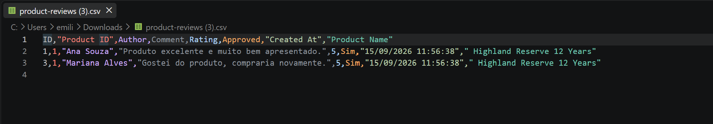
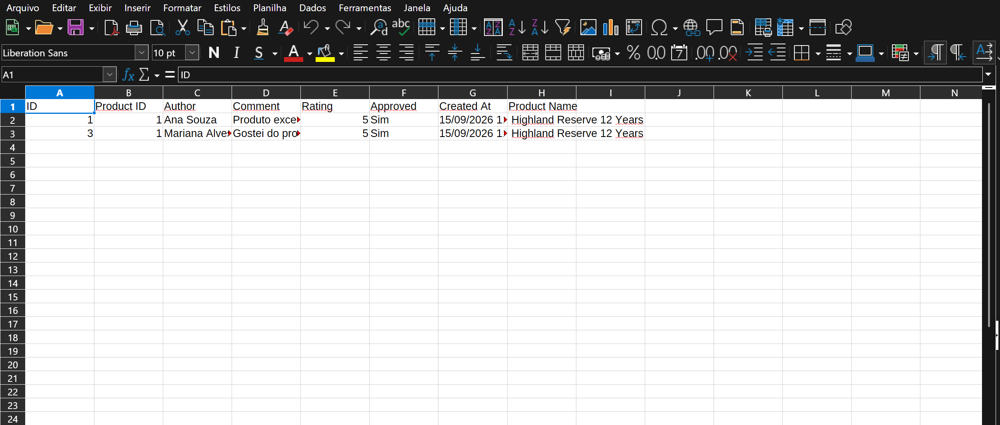
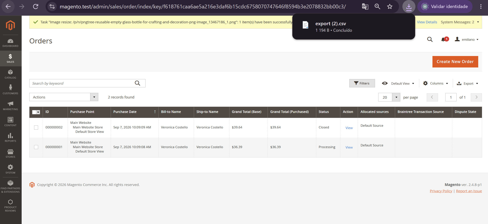
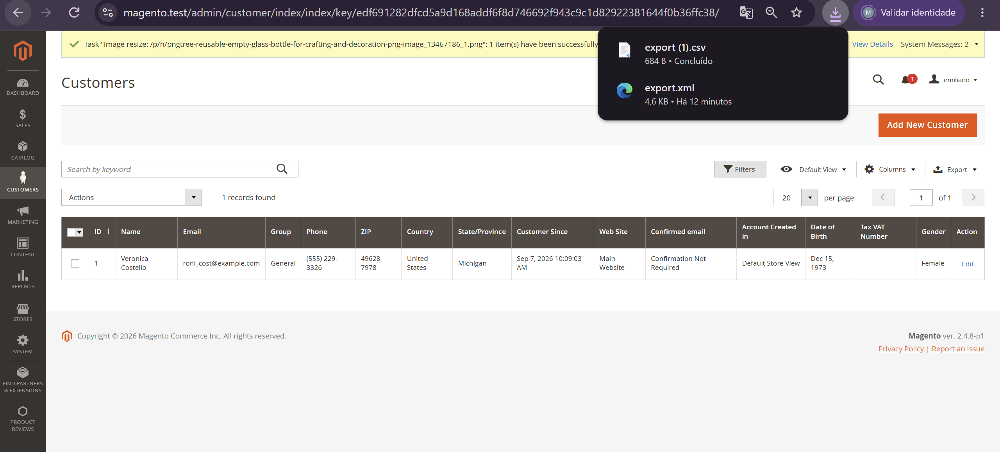

# 🧭 15.3 — Exportação Customizada

> Customização da exportação do módulo `Webjump_ProductReviews` sem afetar os grids nativos do Magento.

---

## 🎯 Objetivo

A exportação das avaliações precisava atender três ajustes solicitados pelo cliente:

```text
Approved
0 / 1
→ Sim / Não

Created At
→ formato brasileiro

Product ID
→ adicionar Product Name
```

A solução também deveria preservar as exportações nativas de Orders e Customers.

---

## 🧱 Estratégia

Foi escolhida uma exportação específica para o módulo.

Não foi criada `preference` global para:

```text
Magento\Ui\Model\Export\ConvertToCsv
Magento\Ui\Model\Export\ConvertToXml
```

Os controllers de `Webjump_ProductReviews` utilizam conversores próprios:

```text
Webjump\ProductReviews\Model\Export\ConvertToCsv
Webjump\ProductReviews\Model\Export\ConvertToXml
```

Fluxo:

```text
Product Reviews Grid
        ↓
ExportCsv / ExportXml
        ↓
Conversor do módulo
        ↓
ProductReviewExportFormatter
        ↓
CSV / Excel XML
```

Assim, as regras específicas de avaliações ficam isoladas e os demais grids continuam utilizando os conversores nativos do Magento.

---

## 🧩 Formatter

As transformações foram centralizadas em:

```text
Model/Export/ProductReviewExportFormatter.php
```

Responsabilidades:

```text
approved
→ Sim / Não

created_at
→ dd/mm/YYYY HH:mm:ss

product_id
→ nome do produto
```

O nome do produto é armazenado temporariamente durante a execução para evitar consultas repetidas ao mesmo produto.

---

## 📄 CSV e Excel XML

Foram criados:

```text
Model/Export/ConvertToCsv.php
Model/Export/ConvertToXml.php
```

Os dois formatos utilizam o mesmo formatter.

Exemplo de resultado:

```text
ID: 1
Product ID: 1
Author: Ana Souza
Rating: 5
Approved: Sim
Created At: 15/09/2026 11:56:38
Product Name: Highland Reserve 12 Years
```

A coluna `Product Name` existe apenas no arquivo exportado e não precisou ser adicionada ao grid.

---

## 🔎 Filtros

A exportação continua utilizando o DataProvider do UI Component.

Foi aplicado:

```text
Rating
From: 5
To: 5
```

Resultado:

```text
Ana Souza
Mariana Alves
```

CSV e Excel XML exportaram somente esses dois registros.

Isso confirma que os filtros do grid continuam sendo respeitados.

---

## 🧪 Testes de Regressão

A customização também foi validada nos grids nativos.

### Orders

Caminho:

```text
Sales
→ Orders
```

Testados:

```text
CSV
Excel XML
```

As exportações continuaram funcionando normalmente e mantiveram as colunas próprias de pedidos.

### Customers

Caminho:

```text
Customers
→ All Customers
```

Testados:

```text
CSV
Excel XML
```

As exportações continuaram funcionando normalmente e mantiveram as colunas próprias de clientes.

Nenhuma transformação de `ProductReviews` apareceu nesses arquivos.

---

## 🛠️ Troubleshooting

Durante o teste de Orders ocorreu:

```text
Not registered handle sales_order_grid_data_source
```

O registro:

```text
webjump_product_review_listing_data_source
```

estava no:

```text
etc/adminhtml/di.xml
```

e estava impedindo a composição correta dos mappings do `CollectionFactory`.

O registro foi movido para:

```text
etc/di.xml
```

O `etc/adminhtml/di.xml` permaneceu apenas com a configuração específica da:

```text
ProductReview\Grid\Collection
```

Após a correção, o DI passou a reconhecer simultaneamente:

```text
sales_order_grid_data_source
webjump_product_review_listing_data_source
```

O grid de Orders e suas exportações voltaram a funcionar normalmente.

---

## 📸 Evidências

### CSV customizado



### Excel XML customizado



### Exportação de Orders



### Exportação de Customers



---

## ✅ Resultado

- [x] `Approved` convertido para `Sim` ou `Não`
- [x] data em formato brasileiro
- [x] coluna `Product Name`
- [x] CSV customizado
- [x] Excel XML customizado
- [x] filtros preservados
- [x] Orders sem regressão
- [x] Customers sem regressão
- [x] nenhuma `preference` global
- [x] nenhum arquivo em `vendor/` alterado

---

## 📌 Status

```text
15.3

├── Approved → Sim / Não         ✅
├── Data brasileira              ✅
├── Product Name                 ✅
├── CSV                          ✅
├── Excel XML                    ✅
├── Filtros                      ✅
├── Orders                       ✅
├── Customers                    ✅
└── Isolamento da customização   ✅
```