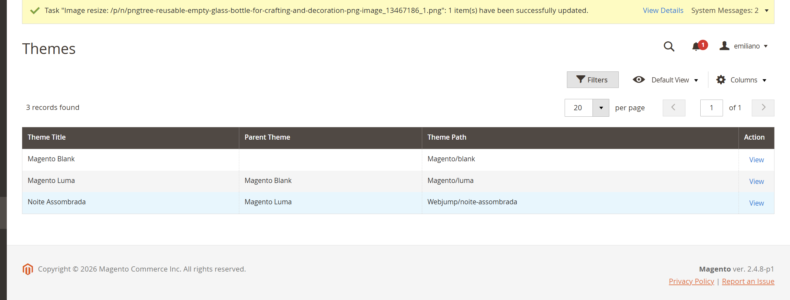
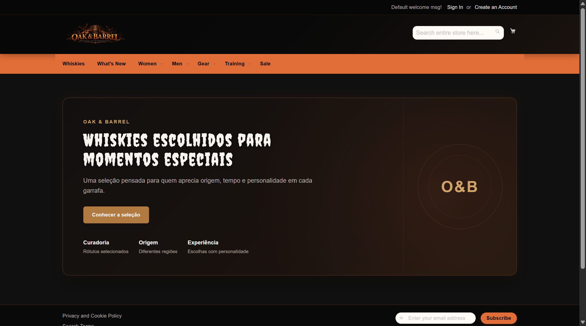
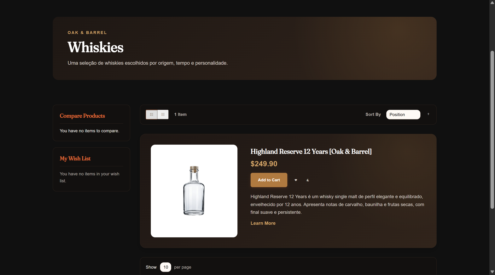
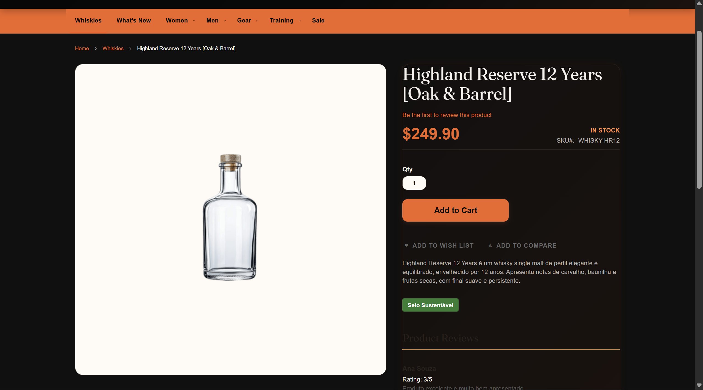
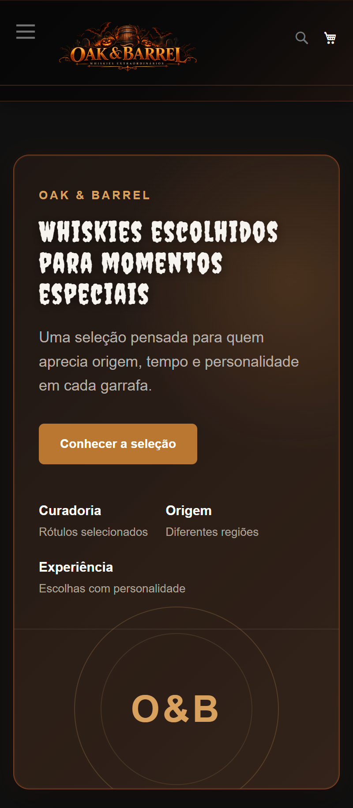

# 🎃 16.1 — Tema Noite Assombrada

> Criação do tema `Webjump/noite-assombrada`, herdando do Luma e aplicando a identidade visual da campanha sem alterar arquivos do núcleo.

---

## 🎯 Objetivo

Criar um tema próprio para a campanha de Halloween com:

```text
tema herdando do Luma
paleta personalizada
tipografia própria
estilos organizados
logo customizada
responsividade
```

Tudo mantendo os arquivos do Magento intactos.

---

## 🧱 Estrutura

```text
Tema:
Webjump/noite-assombrada

Tema pai:
Magento/luma
```

Principais recursos:

- paleta configurada em `_theme.less`;
- estilos adicionais através de `_extend.less`;
- fonte própria carregada pelo tema;
- logo customizada por Layout XML.

---

## 🎨 Variáveis Sobrescritas

| Variável | Motivo |
| --- | --- |
| `@primary__color` | Aplicar o laranja da campanha |
| `@secondary__color` | Utilizar o dourado como cor complementar |
| `@page__background-color` | Aplicar o fundo escuro |
| `@text__color` | Garantir contraste |
| `@heading__color__base` | Manter títulos legíveis |
| `@link__color` | Aplicar a identidade aos links |
| `@link__hover__color` | Destacar interação |
| `@button-primary__background` | Padronizar ações principais |
| `@button-primary__color` | Garantir contraste nos botões |
| `@border-color__base` | Integrar bordas à paleta |

---

## 🧩 Organização do LESS

O `_extend.less` funciona como ponto de entrada dos estilos adicionais.

```text
_extend.less
    ↓
_global.less
_header.less
_footer.less
_elements.less
_home.less
_catalog.less
_product.less
_responsive.less
_fonts.less
```

A separação mantém os estilos organizados por responsabilidade.

---

## 🔤 Fonte Própria

O tema utiliza:

```text
Creepster
```

apenas em elementos de destaque.

Os textos corridos continuam utilizando uma fonte mais legível.

---

## 📸 Evidências

### Tema aplicado no Admin



---

### Home



---

### Categoria



---

### Produto



---

### Responsividade



---

## ✅ Resultado

- [x] tema próprio criado
- [x] herança do Luma configurada
- [x] paleta personalizada
- [x] tipografia personalizada
- [x] LESS organizado por responsabilidade
- [x] fonte própria carregada
- [x] logo personalizada
- [x] identidade aplicada à loja
- [x] responsividade validada
- [x] nenhum arquivo do núcleo alterado

---

## 📌 Status

```text
16.1

├── Tema próprio               ✅
├── Herança do Luma            ✅
├── Paleta                     ✅
├── Tipografia                 ✅
├── LESS organizado            ✅
├── Fonte própria              ✅
├── Logo customizada           ✅
├── Responsividade             ✅
└── Vendor preservado          ✅
```