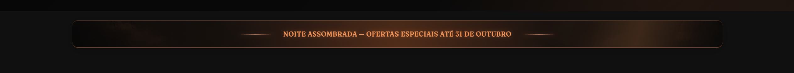
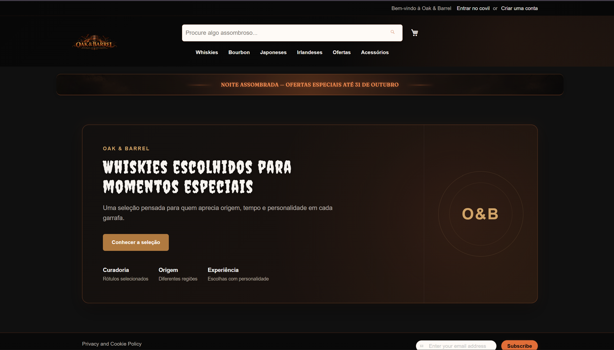
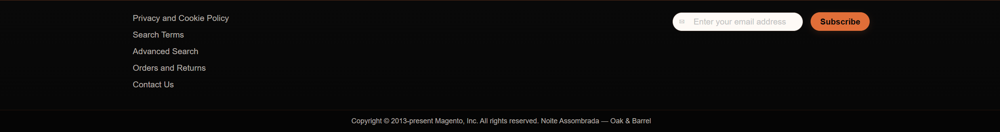
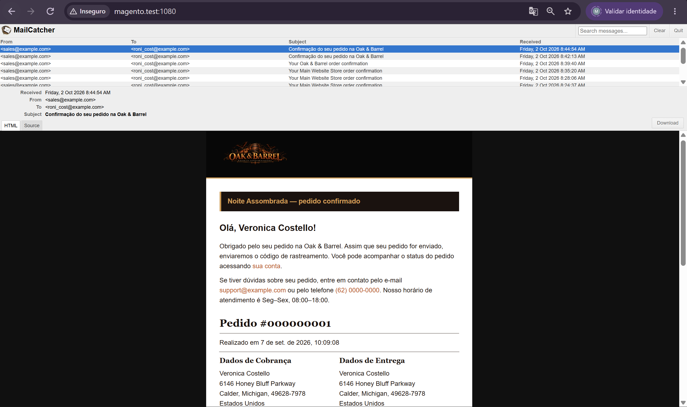

# 🎃 16.2 — Estrutura, Textos e E-mail

> Evolução do tema `Webjump/noite-assombrada` para levar a identidade da campanha também para a estrutura da loja, traduções e e-mail de novo pedido.

---

## 🎯 Objetivo

Implementar no tema:

```text
faixa de campanha
alterações de layout
traduções pt_BR
override de template
e-mail personalizado
```

Tudo utilizando os mecanismos nativos do Magento e sem alterar `vendor/`.

---

## 🧱 Estrutura

Principais arquivos:

```text
Magento_Theme/
├── layout/default.xml
└── templates/html/
    ├── campaign-strip.phtml
    └── copyright.phtml

Magento_Sales/
└── email/order_new.html

i18n/
└── pt_BR.csv

web/css/source/
├── _campaign.less
└── _email-extend.less
```

---

## 🔀 Layout

A faixa da campanha foi adicionada pelo `default.xml` usando:

```text
halloween.campaign.strip
```

Também foram realizadas duas alterações:

```text
catalog.compare.sidebar
→ removido

navigation.sections
→ movido para header-wrapper
```

A faixa utiliza:

```text
campaign-strip.phtml
↓
_campaign.less
```

com textos tratados por:

```php
__()
$block->escapeHtml()
```

---

## 🧩 Override de Template

Foi copiado e sobrescrito:

```text
vendor/magento/module-theme/view/frontend/templates/html/copyright.phtml
```

para:

```text
Magento_Theme/templates/html/copyright.phtml
```

Foi adicionada a identificação:

```text
Noite Assombrada — Oak & Barrel
```

mantendo o conteúdo original do Magento.

---

## 🌎 Traduções

Foi criado:

```text
i18n/pt_BR.csv
```

com seis termos personalizados:

```text
Add to Cart
→ Colocar no caldeirão

Shopping Cart
→ Caldeirão

My Wish List
→ Meus Feitiços

Search entire store here...
→ Procure algo assombroso...

Sign In
→ Entrar no covil

Create an Account
→ Criar uma conta
```

A Store View foi configurada como `pt_BR`.

---

## ✉️ E-mail de Novo Pedido

Foi copiado:

```text
vendor/magento/module-sales/view/frontend/email/order_new.html
```

para:

```text
Magento_Sales/email/order_new.html
```

Foi adicionada a mensagem:

```text
Noite Assombrada — pedido confirmado
```

utilizando:

```text
{{trans}}
```

A identidade visual foi aplicada em:

```text
web/css/source/_email-extend.less
```

---

## 🧪 Validação

O e-mail foi testado no Mailcatcher:

```text
http://magento.test:1080
```

O template customizado foi carregado corretamente com a identidade da campanha.

---

## 📦 Arquivos do Núcleo Copiados

```text
copyright.phtml
→ personalização do rodapé

order_new.html
→ personalização do e-mail de pedido
```

Os arquivos originais em `vendor/` não foram alterados.

---

## 📸 Evidências

### Faixa da campanha



---

### Traduções



---

### Copyright personalizado



---

### E-mail no Mailcatcher



---

## ✅ Resultado

- [x] faixa por Layout XML
- [x] bloco removido
- [x] bloco movimentado
- [x] override de `.phtml`
- [x] seis traduções funcionando
- [x] e-mail personalizado
- [x] Mailcatcher validado
- [x] tradução e escape aplicados
- [x] nenhum arquivo em `vendor/` alterado

---

## 📌 Status

```text
16.2

├── Layout                    ✅
├── Override                  ✅
├── Traduções                 ✅
├── E-mail                    ✅
├── Mailcatcher               ✅
└── Vendor preservado         ✅
```