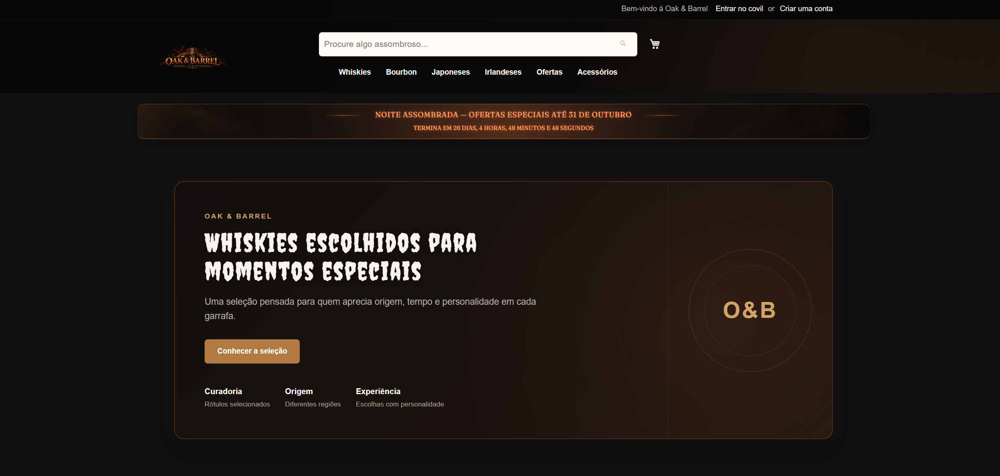
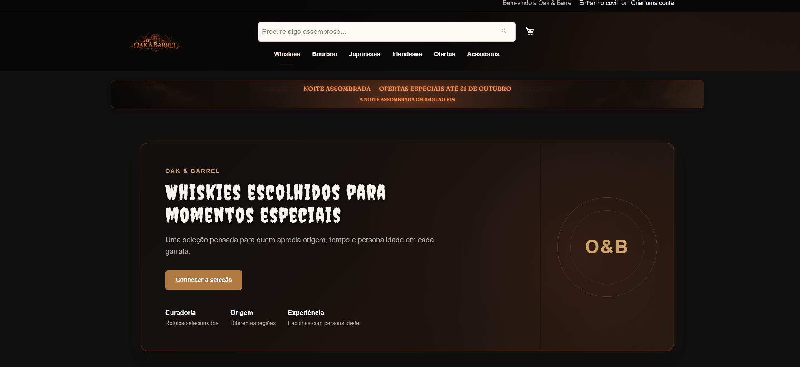
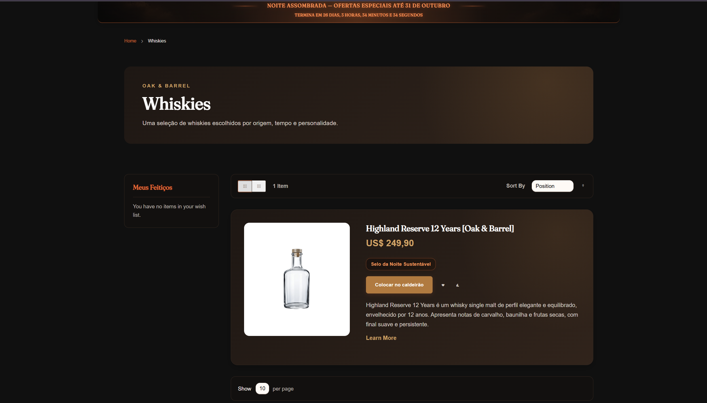
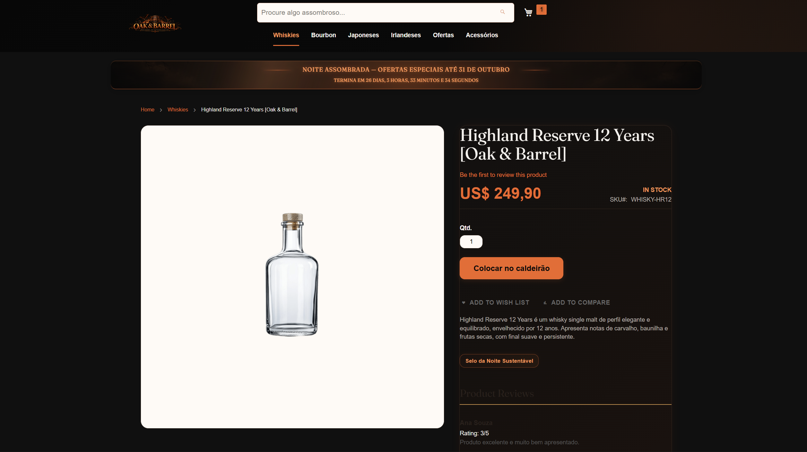
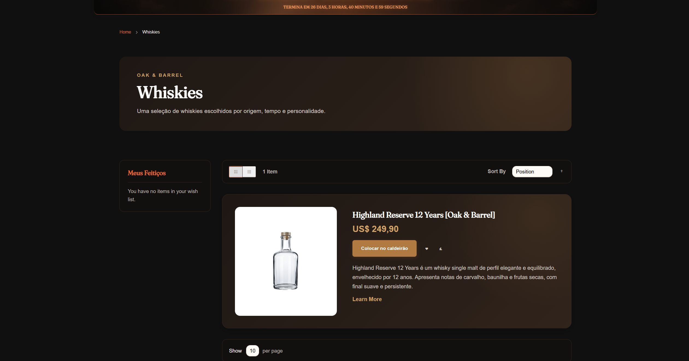

# 🎃 17.1 — Contagem Regressiva e Selo Assombrado

## 🎯 Objetivo

Implementar dois elementos da campanha **Noite Assombrada**:

- contador regressivo até 31 de outubro;
- selo visual nos produtos participantes da campanha.

---

## ⏳ Contador Knockout

O contador foi desenvolvido como componente Knockout utilizando:

- `ko.observable()` para o tempo restante;
- `ko.computed()` para formatar a mensagem;
- `setInterval()` para atualização a cada segundo;
- `mage/translate` para os textos;
- `x-magento-init` para inicialização pelo Magento.

A data final utilizada é:

```text
31/10/2026 23:59:59
America/Sao_Paulo
```

Quando a data já passou, o contador exibe:

```text
A Noite Assombrada chegou ao fim
```

sem apresentar valores negativos.

---

## 🌐 Integração com a campanha

O contador foi mantido como componente independente, mas renderizado dentro da faixa global da campanha.

Estrutura:

```text
default.xml
└── campaign-strip.phtml
    └── countdown.phtml
        ├── countdown.js
        └── countdown.html
```

O requisito pede o contador na Home e na página de produto. Como melhoria adicional, ele foi disponibilizado globalmente junto à faixa da campanha.

---

## 👻 Selo Assombrado

O selo reutiliza o atributo:

```text
sustainable_seal
```

criado anteriormente no módulo `Webjump_ProductReviews`.

Foi criado um novo Data Patch para alterar:

```text
used_in_product_listing = true
```

sem modificar o patch original.

Assim, o atributo também fica disponível na listagem de produtos.

---

## 🛍️ Selo na PLP

Para evitar override de `Magento_Catalog::product/list.phtml`, foi criado um plugin `after` em:

```text
Magento\Catalog\Block\Product\ListProduct::getProductDetailsHtml()
```

O HTML original do Magento é preservado e o selo é acrescentado somente quando:

```text
sustainable_seal = 1
```

Isso também evita interferir nos renderers próprios de produtos configuráveis e seus swatches.

Na PDP, o template existente do selo foi reaproveitado.

Quando o atributo está desativado, nenhum selo é renderizado, não ocorre erro e não fica espaço vazio.

---

## 🌎 Traduções

Os textos do contador utilizam chaves em inglês no JavaScript e são traduzidos pelo:

```text
i18n/pt_BR.csv
```

Exemplos:

```text
Ends in    → Termina em
days       → dias
hours      → horas
minutes    → minutos
seconds    → segundos
```

O texto do selo também passa pelo CSV:

```text
Selo Sustentável
→ Selo da Noite Sustentável
```

---

## 🎨 Visual

O contador possui estilo próprio em:

```text
components/_countdown.less
```

O selo também possui um arquivo próprio:

```text
components/_sustainable-seal.less
```

Assim, o mesmo visual é utilizado na PLP e na PDP, mantendo a identidade marrom e laranja da campanha.

---

## 🧪 Validação

Foram validados:

- contador atualizando sem reload;
- mensagem após a data final;
- funcionamento em desktop e mobile;
- contador na Home e PDP;
- selo na PLP e PDP;
- produto com selo desativado;
- ausência de erro ou espaço vazio sem o selo;
- traduções do contador e selo.

---

## 📂 Principais arquivos

```text
Webjump/ProductReviews/
├── Setup/Patch/Data/UpdateSustainableSealForProductListing.php
├── Plugin/Catalog/Block/Product/ListProductSustainableSealPlugin.php
├── etc/frontend/di.xml
└── view/frontend/templates/product/sustainable-seal.phtml

Webjump/noite-assombrada/
├── Magento_Theme/layout/default.xml
├── Magento_Theme/templates/html/countdown.phtml
├── Magento_Theme/web/template/countdown.html
├── web/js/countdown.js
├── web/css/source/components/_countdown.less
├── web/css/source/components/_sustainable-seal.less
└── i18n/pt_BR.csv
```

---

## 📸 Evidências

### Contador funcionando



---

### Campanha encerrada



---

### Selo na listagem



---

### Selo na página de produto



---

### Produto com selo desativado



---

### Responsividade


---

## ✅ Resultado

O exercício 17.1 foi concluído com contador Knockout em tempo real, tratamento da data encerrada, tradução via CSV e selo da campanha funcionando corretamente na listagem e na página de produto.

**Status: Concluído ✅**