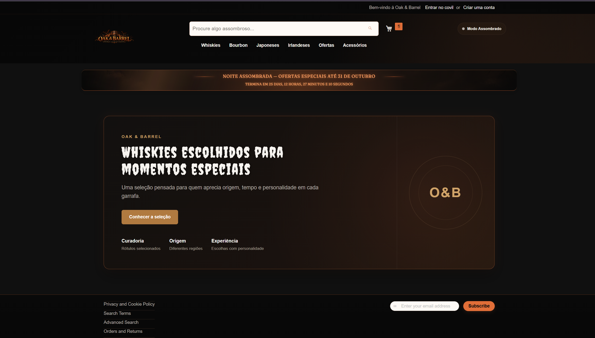
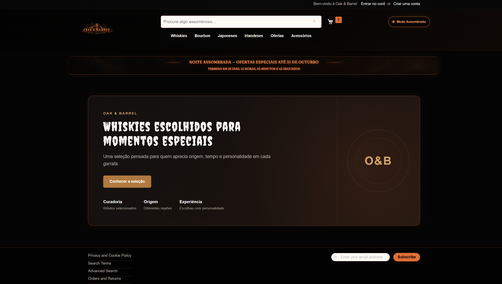
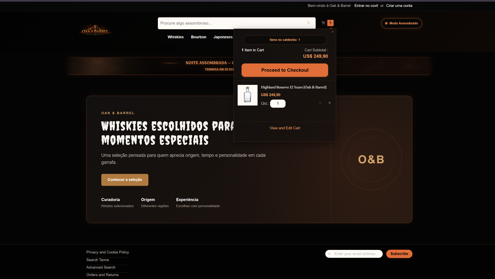
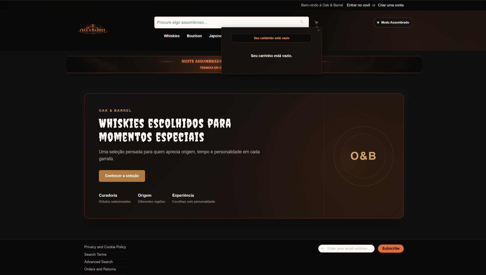
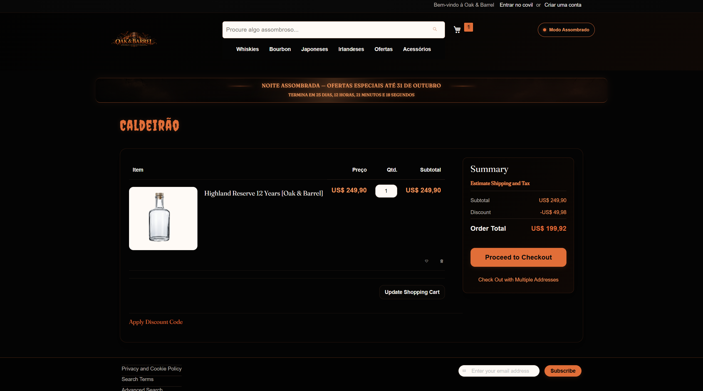
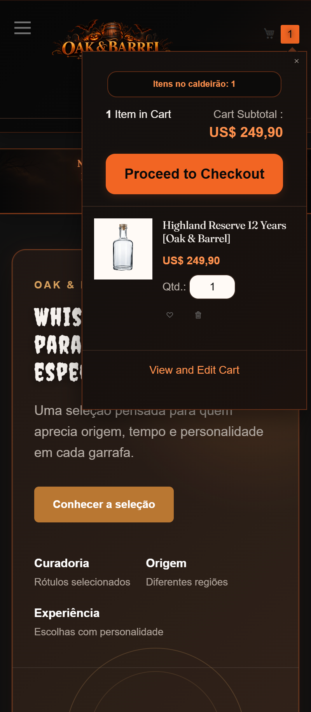

# 👻 17.2 — Modo Assombrado e Minicart

## 🎯 Objetivo

Adicionar comportamento dinâmico à campanha **Noite Assombrada** através de:

- modo visual mais escuro ativado pelo usuário;
- persistência da escolha entre páginas;
- extensão do minicart com uma mensagem dinâmica da campanha.

---

## 🌑 Modo Assombrado

Foi adicionado um interruptor no cabeçalho da loja para ativar e desativar o modo assombrado.

O comportamento é implementado em:

```text
web/js/haunted-mode.js
```

Quando ativado, o JavaScript adiciona ao elemento raiz:

```text
haunted-mode-active
```

O visual reage à classe sem necessidade de recarregar a página.

---

## 💾 Persistência

A escolha do usuário é armazenada no navegador utilizando:

```text
localStorage
```

Chave utilizada:

```text
oak-barrel-haunted-mode
```

Assim, o estado continua ativo ao navegar entre páginas ou atualizar a loja.

---

## ⚙️ Carregamento global

O comportamento é carregado em todas as páginas através do:

```text
requirejs-config.js
```

utilizando:

```js
deps: [
    'js/haunted-mode'
]
```

Fluxo:

```text
requirejs-config.js
        ↓
deps
        ↓
haunted-mode.js
        ↓
localStorage
        ↓
haunted-mode-active
        ↓
tema reage ao estado
```

---

## 🛒 Minicart

O minicart foi estendido através de um mixin sobre:

```text
Magento_Checkout/js/view/minicart
```

Configuração:

```text
requirejs-config.js
        ↓
Magento_Checkout/js/view/minicart
        ↓
js/minicart-mixin
```

O comportamento original do Magento é preservado através de:

```js
this._super();
```

O mixin adiciona um `ko.computed()` que utiliza a quantidade atual do carrinho para montar a mensagem da campanha.

---

## 💬 Mensagem dinâmica

A mensagem reage automaticamente ao valor de:

```text
summary_count
```

Exemplos:

```text
0 itens
→ Seu caldeirão está vazio

1 item
→ Itens no caldeirão: 1

2 itens
→ Itens no caldeirão: 2
```

Também foi previsto um tratamento especial para quantidades maiores conforme a lógica da campanha.

A mensagem é exibida no template customizado:

```text
Magento_Checkout/web/template/minicart/content.html
```

---

## 🔀 Por que mixin e não map?

Foi utilizado um **mixin** porque a necessidade era apenas estender o comportamento do minicart existente.

O `map` substituiria completamente:

```text
Magento_Checkout/js/view/minicart
```

aumentando o escopo da customização e a responsabilidade de reproduzir o comportamento nativo.

Com o mixin:

- o componente original continua sendo utilizado;
- `this._super()` mantém sua inicialização;
- apenas o novo `computed` é acrescentado;
- adicionar, remover e atualizar produtos continua funcionando normalmente.

---

## 🎨 Visual

Os estilos foram separados por responsabilidade:

```text
_haunted-mode.less
→ toggle e estado global do modo assombrado

_minicart.less
→ visual do minicart

_cart.less
→ página completa do carrinho

_theme.less
→ variáveis e cores do tema
```

As cores específicas do Modo Assombrado também foram centralizadas no:

```text
_theme.less
```

evitando valores de cor espalhados pelos componentes.

---

## 🛍️ Página do carrinho

Como melhoria adicional, a página completa do carrinho também recebeu a identidade da campanha.

Foram ajustados:

- container principal;
- título `Caldeirão`;
- produto e preços;
- quantidade;
- ações do carrinho;
- cupom de desconto;
- resumo do pedido;
- botão de checkout;
- visual específico quando o Modo Assombrado está ativo.

O título `Caldeirão` utiliza a fonte temática da campanha e a cor de destaque laranja.

---

## 🧪 Validação

Foram validados:

- modo liga e desliga sem reload;
- classe adicionada ao elemento `<html>`;
- persistência ao navegar entre páginas;
- persistência após atualizar a página;
- carregamento global através de `deps`;
- mixin aplicado ao minicart;
- `this._super()` preservado;
- mensagem dinâmica através de `ko.computed()`;
- carrinho vazio;
- carrinho com produtos;
- adição de produto;
- remoção de produto;
- atualização de quantidade;
- atualização automática da mensagem;
- funcionamento em desktop e mobile.

---

## 📂 Principais arquivos

```text
Webjump/noite-assombrada/
├── requirejs-config.js
├── Magento_Theme/
│   ├── layout/default.xml
│   └── templates/html/haunted-mode-toggle.phtml
├── Magento_Checkout/
│   └── web/template/minicart/content.html
├── web/js/
│   ├── haunted-mode.js
│   └── minicart-mixin.js
├── web/css/source/
│   ├── _theme.less
│   └── components/
│       ├── _haunted-mode.less
│       ├── _minicart.less
│       └── _cart.less
└── i18n/pt_BR.csv
```

---

## 📸 Evidências

### Modo normal



---

### Modo assombrado



---

### Minicart com produto



---

### Minicart vazio



---

### Carrinho no modo assombrado



---

### Responsividade



---

## ✅ Resultado

O exercício 17.2 foi concluído com um modo assombrado persistente, carregado globalmente pelo RequireJS, e com o minicart estendido por mixin sem substituir seu comportamento original.

O carrinho continua permitindo adicionar, remover e atualizar quantidades normalmente, enquanto a mensagem da campanha reage automaticamente ao conteúdo atual.

**Status: Concluído ✅**