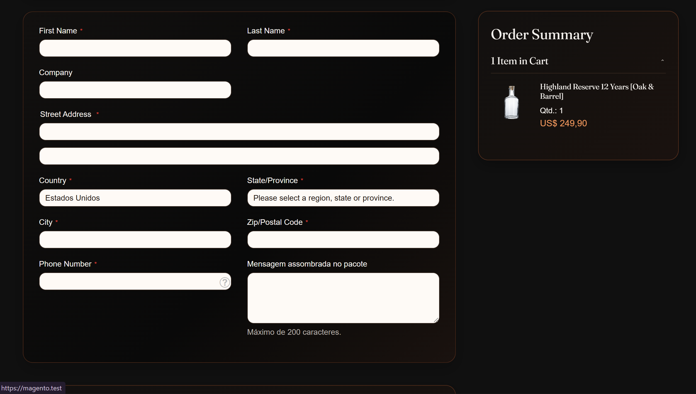
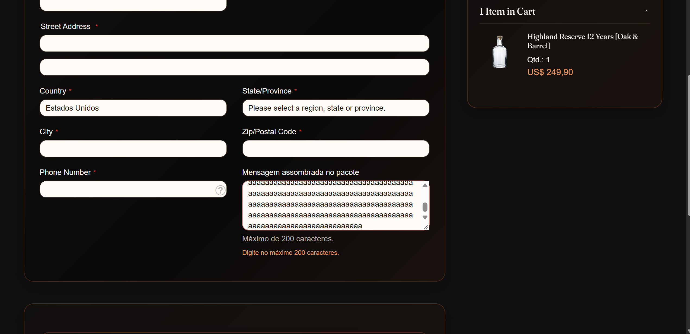
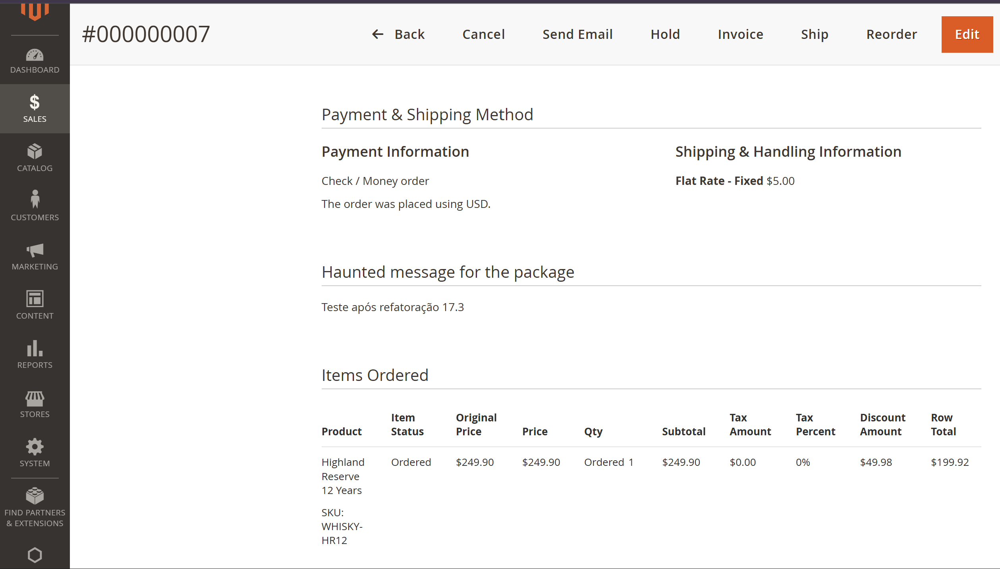
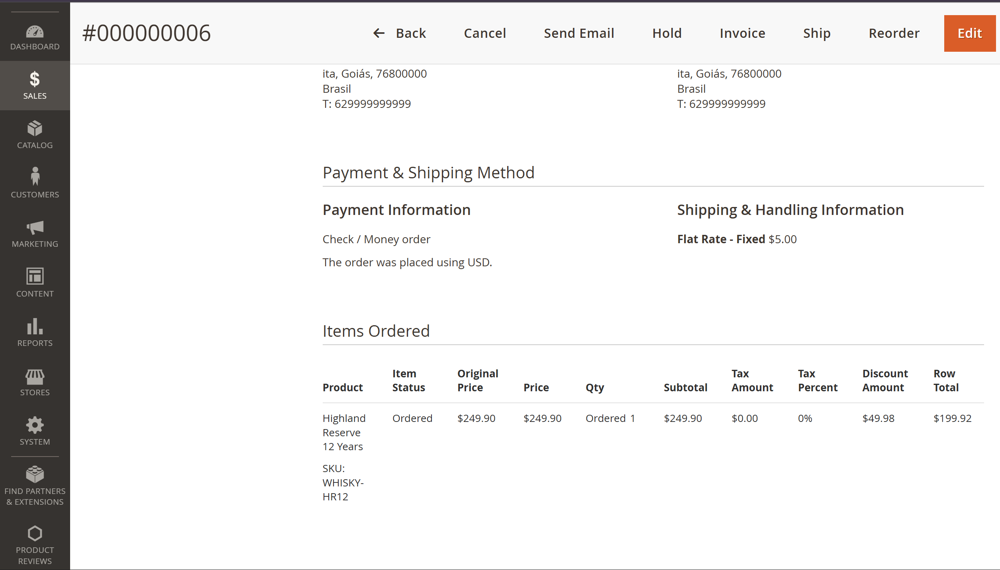
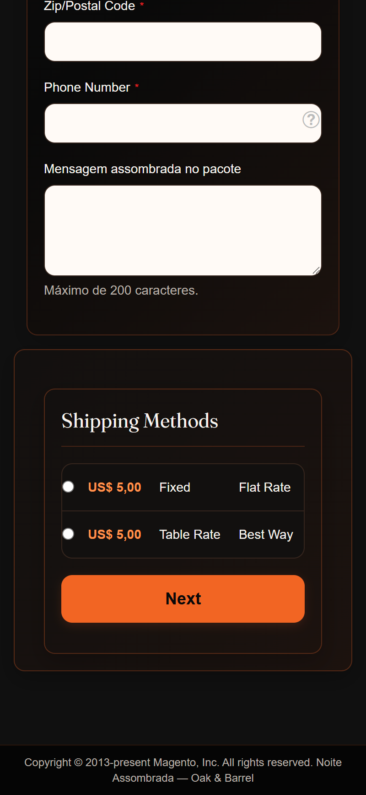

# 👻 17.3 — Mensagem Assombrada no Checkout

## 🎯 Objetivo

Adicionar ao checkout um campo opcional para o cliente escrever uma mensagem que acompanha o pedido e pode ser visualizada no Admin.

---

## 📝 Campo no checkout

O campo foi adicionado por plugin no:

```text
Magento\Checkout\Block\Checkout\LayoutProcessor
```

Ele utiliza um `textarea`, pertence ao escopo:

```text
shippingAddress.haunted_message
```

e possui limite de:

```text
200 caracteres
```

A mensagem de validação é exibida ao usuário quando o limite é ultrapassado.

---

## 💾 Persistência

O valor é enviado através de um `extension_attribute` e capturado durante o envio das informações de entrega.

Fluxo:

```text
Checkout
   ↓
LayoutProcessorPlugin
   ↓
set-shipping-information-mixin
   ↓
extension_attributes.haunted_message
   ↓
ShippingInformationManagementPlugin
   ↓
quote.haunted_message
```

Foram adicionadas colunas em:

```text
quote
sales_order
```

Quando o campo está vazio, o valor é salvo como `NULL`.

---

## 📦 Quote → Pedido

Antes da criação do pedido, um observer copia a mensagem:

```text
quote.haunted_message
        ↓
CopyHauntedMessageToOrder
        ↓
sales_order.haunted_message
```

Foi utilizado o evento:

```text
sales_model_service_quote_submit_before
```

---

## 🖥️ Admin

A mensagem é exibida na visualização do pedido no Admin através de:

```text
sales_order_view.xml
HauntedMessage.php
haunted-message.phtml
```

Se o pedido não possuir mensagem, o bloco não é exibido.

O conteúdo informado pelo cliente é escapado antes da renderização.

---

## 🌐 Tradução

Os textos da funcionalidade ficam em:

```text
Webjump/HauntedCheckout/i18n/pt_BR.csv
```

Exemplos:

```text
Haunted message for the package
→ Mensagem assombrada no pacote

Maximum of 200 characters.
→ Máximo de 200 caracteres.
```

---

## 🧪 Validação

Foram testados:

- campo no passo de entrega;
- limite de 200 caracteres;
- mensagem de erro traduzida;
- persistência no quote;
- gravação em `sales_order`;
- visualização no Admin;
- pedido com mensagem;
- pedido sem mensagem;
- funcionamento em desktop e mobile;
- nenhum arquivo de `Magento_Checkout` alterado diretamente.

---

## 📂 Principais arquivos

```text
Webjump/HauntedCheckout/
├── etc/db_schema.xml
├── etc/extension_attributes.xml
├── etc/frontend/di.xml
├── etc/di.xml
├── etc/events.xml
├── Plugin/Checkout/LayoutProcessorPlugin.php
├── Plugin/Checkout/ShippingInformationManagementPlugin.php
├── Observer/CopyHauntedMessageToOrder.php
├── Block/Adminhtml/Order/View/HauntedMessage.php
├── i18n/pt_BR.csv
└── view/
    ├── frontend/
    └── adminhtml/
```

Estilo do checkout:

```text
Webjump/noite-assombrada/
└── web/css/source/components/_checkout.less
```

---

## 📸 Evidências

### Campo no checkout



---

### Validação de 200 caracteres



---

### Mensagem no Admin



---

### Pedido sem mensagem



---

### Responsividade



---

## ✅ Resultado

A mensagem agora percorre o fluxo:

```text
checkout
→ quote
→ pedido
→ admin
```

com validação de tamanho, suporte a campo vazio e sem alteração direta no módulo `Magento_Checkout`.

**Status: Concluído ✅**