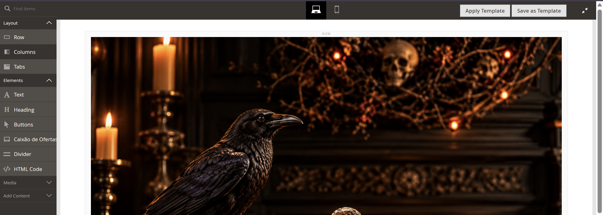
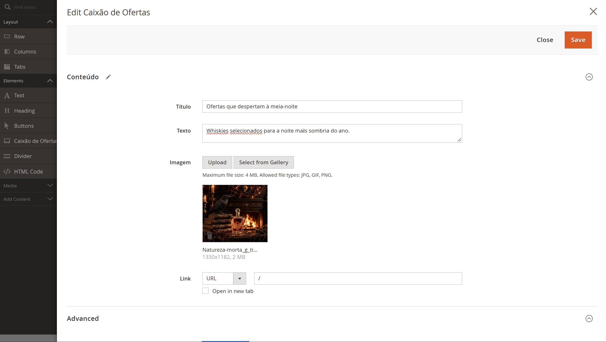
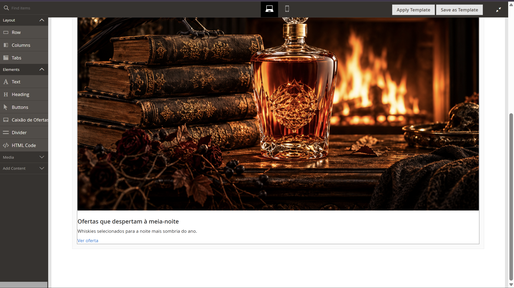
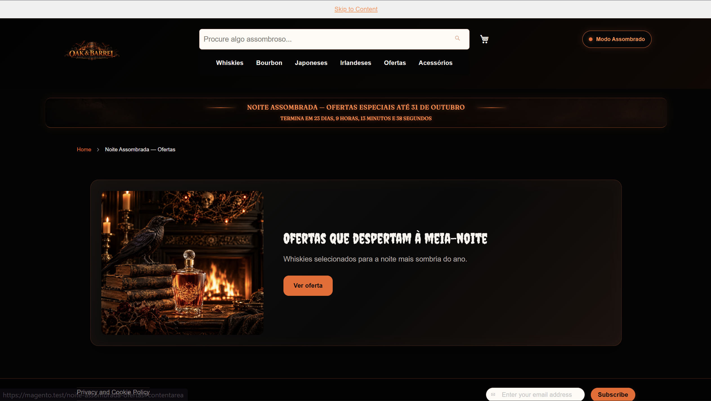
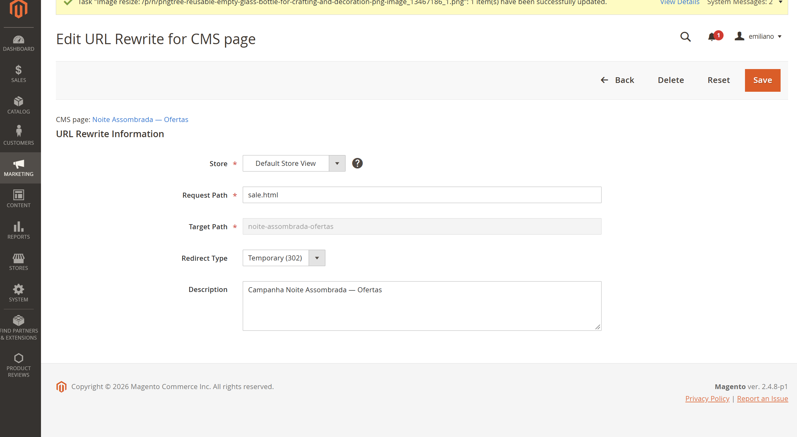

# ⚰️ 17.4 — Caixão de Ofertas no Page Builder

## 🎯 Objetivo

Criar um content type próprio no Page Builder para permitir a criação de blocos promocionais da campanha **Noite Assombrada** sem alteração manual de código.

---

## 🧩 Content Type

Foi criado o módulo:

```text
Webjump_HauntedPageBuilder
```

O componente aparece no Page Builder como:

```text
Caixão de Ofertas
```

e pode ser utilizado dentro de `Row` e `Column`.

---

## ⚙️ Campos configuráveis

O formulário permite configurar:

```text
Título
Texto
Imagem
Link
```

A imagem utiliza o uploader do Page Builder e o link utiliza o componente de URL do Magento.

---

## 👁️ Preview e Master

O componente possui templates separados para editor e storefront:

```text
preview.html
→ visualização dentro do Page Builder

master.html
→ HTML final exibido na loja
```

O elemento externo do preview utiliza:

```text
pagebuilder-content-type
```

permitindo seleção e configuração pelo editor.

---

## 🔄 Fluxo

```text
Page Builder
    ↓
Caixão de Ofertas
    ↓
Formulário
    ↓
Título + Texto + Imagem + Link
    ↓
Preview
    ↓
Master
    ↓
Storefront
```

---

## 🎨 Visual

O componente segue a identidade do tema **Noite Assombrada**:

- fundo escuro;
- borda laranja;
- imagem em destaque;
- CTA laranja;
- layout em duas colunas no desktop;
- layout em uma coluna no mobile.\

---

## 🌐 Página da campanha

Como parte do requisito do exercício, foi criada e publicada uma página utilizando o `Caixão de Ofertas`:

```text
Noite Assombrada — Ofertas
```

URL da página:

```text
/noite-assombrada-ofertas
```

A publicação dessa página é o que atende ao requisito do 17.4 de utilizar o novo content type em uma campanha real.


---

## 🗺️ Navegação pela loja

O exercício não exigia alteração na navegação ou na URL já existente da loja.

Entretanto, durante a validação foi identificado que o item **Ofertas** da navbar continuava direcionando para:

```text
/sale.html
```

que correspondia à página anterior de ofertas do catálogo.

Como melhoria adicional de integração, foi criado um redirecionamento temporário:

```text
/sale.html
        ↓
302 Temporary Redirect
        ↓
/noite-assombrada-ofertas
```

Dessa forma, não foi necessário adicionar um novo item à navegação. O usuário continua utilizando o item **Ofertas** já existente e, durante a campanha, é direcionado para a página criada com o novo content type.

O redirecionamento `302` foi escolhido por se tratar de uma alteração temporária associada à campanha **Noite Assombrada**.

Essa alteração não faz parte da implementação obrigatória do `Caixão de Ofertas`; foi adicionada como melhoria de navegação para integrar a página da campanha ao fluxo normal da loja.

--- 

## 🧪 Validação

Foram validados:

- componente disponível no painel;
- arrastar para a página;
- configuração pelo formulário;
- quatro campos configuráveis;
- imagem;
- link;
- preview no editor;
- master na loja;
- mesmos dados no editor e storefront;
- identidade visual do tema;
- responsividade desktop e mobile;
- página de campanha publicada;
- acesso através do item Ofertas.

---

## 📂 Principais arquivos

```text
Webjump/HauntedPageBuilder/
├── etc/
├── registration.php
└── view/adminhtml/
    ├── layout/
    ├── pagebuilder/content_type/
    ├── ui_component/
    └── web/
        ├── js/content-type/webjump-caixao/
        └── template/content-type/webjump-caixao/
```

Estilo:

```text
Webjump/noite-assombrada/
└── web/css/source/components/_pagebuilder-caixao.less
```

---

## 📸 Evidências

### Componente no Page Builder

O `Caixão de Ofertas` aparece no painel de elementos do Page Builder.



---

### Formulário de configuração

Título, texto, imagem e link podem ser configurados pelo editor.



---

### Preview no editor

Os dados configurados aparecem no próprio Page Builder.



---

### Página publicada

O mesmo conteúdo é renderizado na página da campanha.



---

### Responsividade

O componente reorganiza o conteúdo para uma coluna em viewport mobile.


---

### Navegação pela loja

O item `Ofertas` da navegação leva o usuário para a página da campanha.



---

## ✅ Resultado

O `Caixão de Ofertas` permite montar blocos promocionais diretamente pelo Page Builder utilizando título, texto, imagem e link.

O conteúdo configurado no editor é reproduzido na storefront, possui visual integrado ao tema e funciona em desktop e mobile.

**Status: Concluído ✅**