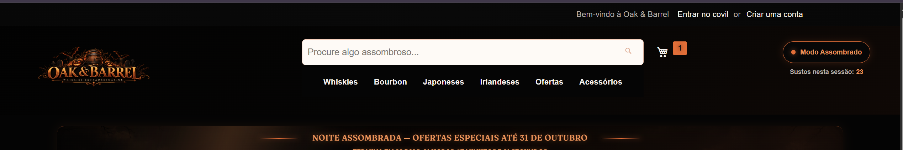
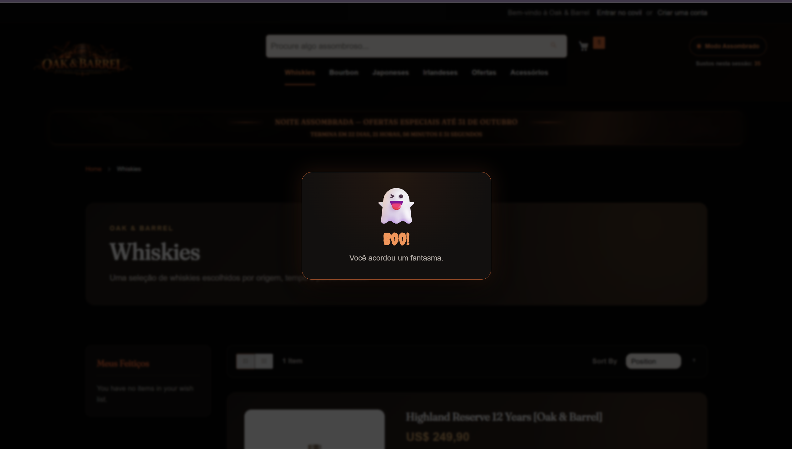
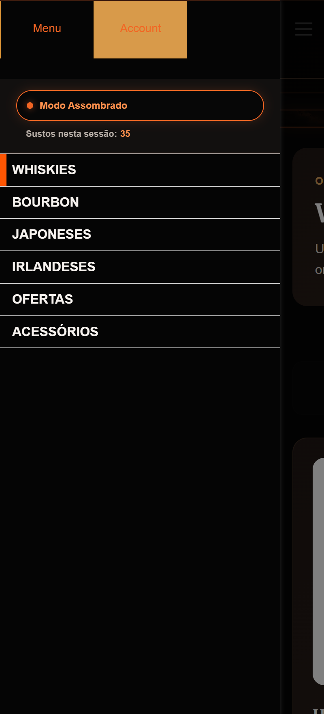

# 👻 17.6 — Seção própria de customer-data

## 🎯 Objetivo

Criar um contador de sustos individual por visitante, atualizado sem recarregar a página utilizando `customer-data`.

---

## 🧩 Implementação

Foi criado o módulo:

```text
Webjump_HauntedCustomerData
```

A seção:

```text
haunted-scares
```

é registrada no `di.xml` e utiliza uma classe que implementa:

```php
Magento\Customer\CustomerData\SectionSourceInterface
```

O valor do contador é armazenado na sessão do visitante.

---

## 🔄 Fluxo

Ao ativar o **Modo Assombrado**:

```text
Modo Assombrado
      ↓
jumpscare
      ↓
POST haunted/scare/increment
      ↓
sessão +1
      ↓
sections.xml invalida haunted-scares
      ↓
customer-data recarrega
      ↓
Knockout atualiza o contador
```

O contador é atualizado sem reload da página.

---

## 👻 Integração

O susto foi integrado ao recurso já existente de **Modo Assombrado**.

- ativar o modo gera um susto;
- desativar não incrementa;
- ativar novamente registra um novo susto;
- navegar com o modo já ativo não incrementa automaticamente.

Também foi adicionado um pequeno jumpscare em pop-out.

---

## 👤 Sessão individual

O contador é individual por visitante.

Foi validado em janela normal e anônima, com valores independentes.

Nenhum valor individual é impresso diretamente pelo PHP no HTML.

O PHP apenas inicializa o componente, enquanto o valor é carregado pelo `customer-data`.

---

## 🖥️ Interface

No desktop:

```text
[ Modo Assombrado ]
  Sustos nesta sessão: X
```

No mobile, o mesmo painel é movido para dentro da navegação.

---

## 🧪 Validação

Foram validados:

- seção própria de `customer-data`;
- registro no `di.xml`;
- `SectionSourceInterface`;
- ação declarada no `sections.xml`;
- valor individual por sessão;
- leitura pelo componente Knockout;
- atualização sem reload;
- contador independente entre visitantes;
- nenhum dado individual renderizado pelo PHP;
- funcionamento em desktop e mobile.

---

## 📂 Principais arquivos

```text
Webjump/HauntedCustomerData/
├── Controller/Scare/Increment.php
├── CustomerData/ScareCounter.php
├── etc/frontend/
│   ├── di.xml
│   ├── routes.xml
│   └── sections.xml
└── view/frontend/
    ├── layout/default.xml
    ├── templates/scare-counter.phtml
    └── web/
        ├── js/view/scare-counter.js
        └── template/scare-counter.html
```

Também foram ajustados no tema:

```text
haunted-mode.js
_haunted-mode.less
_scare-counter.less
```

---

## 📸 Evidências

### Contador no desktop

O contador de sustos é exibido logo abaixo do botão `Modo Assombrado` no header.



---

### Jumpscare

Ao ativar o `Modo Assombrado`, o jumpscare é exibido sobre a página e o contador é incrementado.



---

### Navegação mobile

No mobile, o mesmo painel de `Modo Assombrado` e o contador são movidos para dentro da navegação.



---

## ✅ Resultado

O contador de sustos é armazenado por sessão, consumido via `customer-data` e atualizado automaticamente após a ação registrada no `sections.xml`.

A funcionalidade foi integrada ao Modo Assombrado sem imprimir dados individuais diretamente no HTML.

**Status: Concluído ✅**